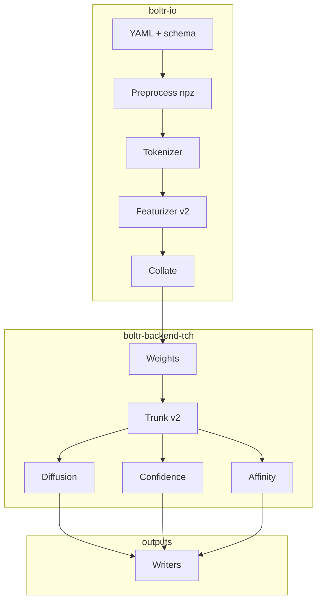

# Boltr — implementation backlog (checkpoint)

Rust port of **Boltz2** inference (`boltz-reference/`) using **`tch-rs` + LibTorch** (CPU or CUDA). This file is the **actionable checklist**; narrative history lives in **[docs/activity.md](docs/activity.md)**. Rolling featurizer notes: **[tasks/todo.md](tasks/todo.md)**.

**Parity target:** PyTorch **fallback** path (`use_kernels=False`). Prefer **golden tensors** vs Python on fixed fixtures before marking work complete.

**Also read:** [DEVELOPMENT.md](DEVELOPMENT.md), [docs/TENSOR_CONTRACT.md](docs/TENSOR_CONTRACT.md), [docs/PYTHON_REMOVAL.md](docs/PYTHON_REMOVAL.md), [docs/PAIRFORMER_IMPLEMENTATION.md](docs/PAIRFORMER_IMPLEMENTATION.md), [boltz-reference/docs/prediction.md](boltz-reference/docs/prediction.md).

---

## 1. Parity rules (non-negotiable)

| Topic | Rule |
|--------|------|
| Reference CLI | `boltz-reference/src/boltz/main.py` — URLs, preprocess, datamodules, writers. |
| Checkpoint | `.ckpt` → [scripts/export_checkpoint_to_safetensors.py](scripts/export_checkpoint_to_safetensors.py); Rust loads `.safetensors` into `tch` (names match after strip-prefix). |
| Triangle / pair ops | Match PyTorch fallback ([triangular_mult.py](boltz-reference/src/boltz/model/layers/triangular_mult.py), triangular_attention without cuequivariance). |
| Mixed precision | Mirror Python `autocast("cuda", enabled=False)` islands; explicit F32 where Python disables autocast. |
| Tests | Golden tensors or explicit v1 scope sign-off. |

---

## 2. Dependency order

---

## 3. Snapshot — what is done (March 2026)

### `boltr-io`

- YAML/config types; MSA (A3M/CSV → npz, ColabFold client); **StructureV2** npz I/O; **tokenize_structure** + `TokenData` / bonds.
- **Featurizer:** `process_token_features`, `process_msa_features`, **`process_atom_features`** (canonical AA + nucleic, `AtomRefDataProvider`), **dummy templates**; **`atom_features_from_inference_input`**; **`trunk_smoke_feature_batch_from_inference_input`** = token + MSA + atoms + dummy templates.
- **Collate:** `FeatureBatch`, `collate_inference_batches`, `pad_to_max_f32`, excluded keys aligned with Python.
- **Inference:** `load_input` + manifest; smoke fixtures; goldens: token (ALA), MSA (smoke), atom (schema + **partial** allclose — skip list for RDKit/NPZ-aligned keys in [atom_features_golden.rs](boltr-io/src/featurizer/atom_features_golden.rs)), two-example MSA pad golden.
- Constants: `boltz_const`, `ref_atoms`, vdw, ligand exclusion, `ambiguous_atoms` + JSON.

### `boltr-backend-tch`

- Device, safetensors load, **Boltz2Model** + **TrunkV2**, **PairformerModule** (full layer stack), **MSAModule** (wired), **TemplateModule** (stub).
- **RelativePositionEncoder**, **token_bonds** (+ optional type), **ContactConditioning**, partial **InputEmbedder** (needs full atom encoder stack).
- **`predict_step_trunk`** (recycling + trunk + optional MSA; not full predict).
- Opt-in goldens: pairformer layer, MSA module; smoke: [collate_predict_trunk.rs](boltr-backend-tch/tests/collate_predict_trunk.rs).

### Tooling / CLI

- LibTorch docs, `scripts/cargo-tch` / `with_dev_venv.sh`, Makefile checkpoint targets, optional CI workflow for backend.
- **`boltr download`**; **`predict`** partial (full pipeline blocked on §4–5 below).

---

## 4. `boltr-io` featurizer track (§2b) — ordered plan

| # | Deliverable | Status |
|---|-------------|--------|
| 1 | `pad_to_max` + inference collate | **Done** — [collate_pad.rs](boltr-io/src/collate_pad.rs) |
| 2 | MSA pairing + `process_msa_features` + golden | **Done** |
| 3a | Dummy templates + merged `FeatureBatch` (incl. atoms) | **Done** — [inference_dataset.rs](boltr-io/src/inference_dataset.rs) |
| **3b** | **Real `process_template_features`** | **Open** — tokenizer/bookkeeping + [featurizerv2.py](boltz-reference/src/boltz/data/feature/featurizerv2.py) ~1696+ |
| 4 | `process_atom_features` | **Partial** — Rust + inference merge + partial golden allclose; **TBD:** full-key allclose on **same** NPZ + mols; ligands via CCD/`AtomRefDataProvider` |
| 5 | Full post-collate dict golden | **Open** — variable-`N` batch `allclose` vs Python |

*Affinity MSA variant, symmetry/ensemble/constraint maps, affinity crop: out of scope for this track unless explicitly scheduled.*

---

## 5. Prioritized remaining work

1. **Templates (IO + backend):** §2b **3b** — real template features in `boltr-io`; replace **TemplateModule** stub in `boltr-backend-tch` ([template_module.rs](boltr-backend-tch/src/boltz2/template_module.rs)).
2. **Collate / golden closure:** Full trunk featurizer dict `allclose` (§2b **5**); extend atom allclose when Rust and Python use identical structure + mols.
3. **Input embedder + atoms → `s_inputs`:** Complete **AtomEncoder** / **AtomAttentionEncoder** path; wire `FeatureBatch` atom keys into model (today trunk tests use pre-built `s_inputs` from fixtures).
4. **Checkpoint / config:** Full **VarStore** map vs standard Lightning export (§6.2); complete **Boltz2Hparams** / `from_config` parity.
5. **Diffusion + confidence + affinity:** Replace placeholders in `boltr-backend-tch` (`diffusion`, `confidence`, `affinity` modules); blocks full **`predict_step`**.
6. **Writers:** BoltzWriter / mmcif / pdb / affinity writer parity with Python `data/write/`.
7. **Schema / chemistry at scale:** Full YAML parse, CCD/mols loading, structure parsers; constraints / `extra_mols` in `load_input`.
8. **CLI:** Full `predict` wiring, flags parity, optional `eval`.

---

## 6. Detailed status tables (reference)

### 6.1 `boltr-io` — open or partial

| Area | Status | Notes |
|------|--------|--------|
| Full schema / CCD / mmCIF-PDB parsers | Open | [config.rs](boltr-io/src/config.rs) minimal; needs `mol.py`-class pipeline |
| Tokenizer trait + template token loop | Partial | [tokenize/boltz2.rs](boltr-io/src/tokenize/boltz2.rs) core done |
| `process_template_features` | Open | Dummy only — [dummy_templates.rs](boltr-io/src/featurizer/dummy_templates.rs) |
| `process_atom_features` | Partial | Inference + merge done; full Python allclose + ligands TBD |
| `load_input` constraints / extra_mols | Open | |
| Affinity crop | Open | If needed for affinity inference |
| Writers | Open | `data/write/writer.py` parity |

### 6.2 `boltr-backend-tch` — open or partial

| Area | Status | Notes |
|------|--------|--------|
| VarStore vs full ckpt | Partial | Smoke [boltz2_smoke.safetensors](boltr-backend-tch/tests/fixtures/boltz2_smoke/boltz2_smoke.safetensors); allowlist TBD |
| InputEmbedder | Partial | Needs full atom stack |
| RelativePositionEncoder / z_init | Partial | Golden parity TBD |
| TemplateModule | Stub | |
| Diffusion / confidence / affinity | Placeholder | [diffusion.rs](boltr-backend-tch/src/boltz2/diffusion.rs), [confidence.rs](boltr-backend-tch/src/boltz2/confidence.rs), [affinity.rs](boltr-backend-tch/src/boltz2/affinity.rs) |
| `predict_step` (e2e) | Open | `predict_step_trunk` only today |

### 6.3 Tooling

| Task | Status |
|------|--------|
| LibTorch / device / Makefile / CI smoke | Done |
| Full hparams / Lightning dict parity | Partial |

### 6.4 CLI

| Task | Status |
|------|--------|
| `download` | Done |
| `predict` | Partial — full pipeline blocked |
| Flags parity, `eval` | Open |

### 6.5 Testing

| Task | Status |
|------|--------|
| Layer goldens (pairformer, MSA opt-in) | Done / opt-in |
| Featurizer goldens (token, MSA, atom partial) | Partial |
| Full regression `boltz predict` vs `boltr predict` | Open |

---

## 7. Parallel workstreams

1. **Featurizer / collate:** §2b **3b** templates → §2b **5** full collate golden; atom allclose on aligned fixtures.
2. **Trunk integration:** Full embedder, real TemplateModule, VarStore audit; feed [trunk_smoke_feature_batch_from_inference_input](boltr-io/src/inference_dataset.rs).
3. **Diffusion:** Blocked on trunk outputs + featurizer contract.
4. **Writers:** Can proceed from Python output dumps.
5. **Affinity:** Blocked on affinity featurizer + §5.8.

---

## 8. Python removal

Gated by test coverage — see [docs/PYTHON_REMOVAL.md](docs/PYTHON_REMOVAL.md). Keep `boltz-reference/` until Rust replaces each slice with goldens.

---

## 9. Quick reference — Python files (inference parity)

**Core:** `main.py`, `data/module/inferencev2.py`, `data/feature/featurizerv2.py`, `data/tokenize/boltz2.py`, `data/types.py`, `data/const.py`, `data/pad.py`, `data/mol.py`, `model/models/boltz2.py`, `model/modules/trunkv2.py`, `diffusionv2.py`, `diffusion_conditioning.py`, `confidencev2.py`, `affinity.py`, `encodersv2.py`, `transformersv2.py`, `model/layers/pairformer.py`, attention/triangular/transition/outer_product_mean, `data/write/writer.py`.

**Lower priority (training):** `training*`, `sample/*`, most of `loss/*`, `optim/*` unless needed for inference EMA.

---

*Last updated: 2026-03-27 — Checkpoint refresh: consolidated backlog; see [docs/activity.md](docs/activity.md) for milestone narrative.*
