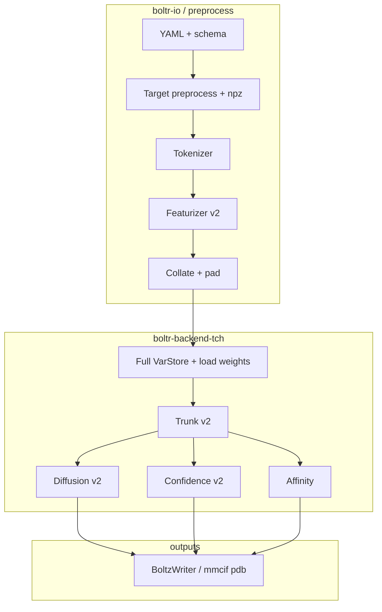

# Boltr: Boltz2-in-Rust developer backlog

This file is the **master implementation checklist** for parity with upstream Boltz2 (`boltz-reference/`), using **`tch-rs` + LibTorch** (CPU or CUDA). It is meant to be split across engineers without losing track of dependencies.

**Do not treat items as done until** there is either a **golden test** (tensor or file diff vs Python on a fixed fixture) or an **explicit sign-off** that the slice is out of scope for v1.

---

## How to use this document

1. For **featurizer + collate** work in `boltr-io`, follow **§2b** first (ordered phases), then the detailed tables in §4.4–4.5. Otherwise pick a **workstream** (sections 3–7). Read the **Python reference paths** first.
2. Note **Depends on** before starting; unblock upstream tasks first.
3. For each task, complete **Deliverables** and **Acceptance**.
4. Update the checkbox in your PR (`[ ]` → `[x]`) for the rows you finish.
5. Keep **numerical parity** against Python with `use_kernels=False` (no cuequivariance fused kernels in Rust). GPU = CUDA LibTorch, not Python’s `boltz[cuda]` wheels.

**Related docs:** [DEVELOPMENT.md](DEVELOPMENT.md), [docs/TENSOR_CONTRACT.md](docs/TENSOR_CONTRACT.md), [docs/PYTHON_REMOVAL.md](docs/PYTHON_REMOVAL.md), [boltz-reference/docs/prediction.md](boltz-reference/docs/prediction.md), [docs/PAIRFORMER_IMPLEMENTATION.md](docs/PAIRFORMER_IMPLEMENTATION.md).

**Sprint / activity tracking:** [tasks/todo.md](tasks/todo.md) (rolling checklist), [docs/activity.md](docs/activity.md) (timeline), [docs/PROJECT_README.md](docs/PROJECT_README.md) (project context for tooling).

---

## 1. Parity rules (non-negotiable)

| Topic | Rule |
|--------|------|
| Reference CLI | `boltz-reference/src/boltz/main.py` defines URLs, preprocess steps, datamodules, writers. |
| Checkpoint | Lightning `.ckpt` → export with [scripts/export_checkpoint_to_safetensors.py](scripts/export_checkpoint_to_safetensors.py); Rust loads `.safetensors` into `tch` (key names must match after any `strip-prefix`). |
| Triangle / pair ops | Match **PyTorch fallback** when `use_kernels=False` (`boltz-reference/.../triangular_mult.py`, `triangular_attention/` without cuequivariance). |
| Mixed precision | Boltz2 inference uses bf16 in places; mirror Python’s **`autocast("cuda", enabled=False)` islands** with explicit F32 where Python disables autocast. |
| Tests | Prefer **golden tensors** exported from Python for the smallest input that exercises the code path. |

---

## 2. High-level dependency order

Work generally flows **top-to-bottom**. Multiple people can parallelize **within** a stage only when dependencies are clear (e.g. layers inside pairformer after tensor shapes are frozen).

---

## 2b. `boltr-io` featurizer + collate — single ordered plan

Use this as the **one checklist** for preprocess → features → batch (see also [`.cursor/plans/featurizer_collate_parity_e7ccf120.plan.md`](.cursor/plans/featurizer_collate_parity_e7ccf120.plan.md) for file-level detail).

| Order | Deliverable | Status | Notes |
|-------|-------------|--------|--------|
| **1** | `pad_to_max` + inference `collate` | **Done** | [`collate_pad.rs`](boltr-io/src/collate_pad.rs): `pad_to_max_f32`, `collate_inference_batches`, `InferenceCollateResult`; [`INFERENCE_COLLATE_EXCLUDED_KEYS`](boltr-io/src/feature_batch.rs) matches Python `inferencev2.collate`. |
| **2** | `construct_paired_msa` + `process_msa_features` + golden | **Done** | [`msa_pairing.rs`](boltr-io/src/featurizer/msa_pairing.rs), [`process_msa_features.rs`](boltr-io/src/featurizer/process_msa_features.rs), [`msa_features_from_inference_input`](boltr-io/src/inference_dataset.rs). **Golden:** [`scripts/dump_msa_features_golden.py`](scripts/dump_msa_features_golden.py) → `msa_features_load_input_smoke_golden.safetensors` + [`msa_features_golden.rs`](boltr-io/src/featurizer/msa_features_golden.rs). RNG only affects `msa_sampling=True` path. |
| **3a** | Dummy templates + merged `FeatureBatch` | **Done** | [`dummy_templates.rs`](boltr-io/src/featurizer/dummy_templates.rs); [`TokenFeatureTensors::to_feature_batch`](boltr-io/src/featurizer/process_token_features.rs) / [`MsaFeatureTensors::to_feature_batch`](boltr-io/src/featurizer/process_msa_features.rs); [`trunk_smoke_feature_batch_from_inference_input`](boltr-io/src/inference_dataset.rs) merges token + MSA + dummy templates (no atoms, no `s_inputs`). Test: [`trunk_smoke_feature_batch_covers_collate_manifest_keys`](boltr-io/tests/load_input_dataset.rs). |
| **3b** | Real `process_template_features` | **Open** | Needs `template_tokens` per template name (tokenizer / bookkeeping); port `compute_template_features` + stacking + `template_force` / thresholds ([`featurizerv2.py`](boltz-reference/src/boltz/data/feature/featurizerv2.py) ~1696–1837). |
| **4** | `process_atom_features` | **[~]** | **Golden + schema + sanity:** [`dump_atom_features_golden.py`](scripts/dump_atom_features_golden.py) → `atom_features_ala_golden.safetensors`; [`atom_features_golden.rs`](boltr-io/src/featurizer/atom_features_golden.rs); `atom_pad_mask` sum matches [`ALA_STANDARD_HEAVY_ATOM_COUNT`](boltr-io/src/featurizer/process_atom_features.rs). **Still open:** Rust tensor port (RDKit-only fields) + structure-only `allclose` slices. |
| **5** | §4.4 collate acceptance | **[~]** | Unit tests + [`collate_two_msa_golden.safetensors`](boltr-io/tests/fixtures/collate_golden/collate_two_msa_golden.safetensors) ([`dump_collate_two_example_golden.py`](scripts/dump_collate_two_example_golden.py)) vs [`collate_inference_batches`](boltr-io/src/collate_pad.rs) (`collate_golden::tests::collate_two_msa_matches_golden_pad_to_max`). **TBD:** full trunk featurizer post-collate dict `allclose`. |

**Out of scope for this track (separate checklists):** affinity MSA variant, symmetry / ensemble / constraint feature maps, affinity crop — see §4.4 notes and §5.8.

---

## 2a. Recent progress log

| When | What landed | Notes |
|------|-------------|--------|
| 2025-03-22 | **Pairformer stack (§5.5)** in `boltr-backend-tch` | Full layer implementations: `AttentionPairBiasV2`, triangle mult/attn (fallback path), `Transition`, `OuterProductMean`, `PairformerLayer`, `PairformerModule`. See [docs/PAIRFORMER_IMPLEMENTATION.md](docs/PAIRFORMER_IMPLEMENTATION.md). **Unit tests** exist behind `--features tch-backend` + LibTorch. |
| 2025-03-22 | **`PairformerModule` owned by `TrunkV2`** | [boltz2/trunk.rs](boltr-backend-tch/src/boltz2/trunk.rs): `initialize`, recycling projections + norms, `forward_pairformer`, recycling loop calling pairformer. Submodule constructors use **`tch::nn::Path`** (`vs.root().sub("…")`) — **no** `Path::fork()` (not in tch 0.16). |
| 2025-03-22 | **`Boltz2Model` wraps `TrunkV2`** | [boltz2/model.rs](boltr-backend-tch/src/boltz2/model.rs): single `VarStore`, `forward_trunk(s_inputs, recycling_steps, msa_feats)`, `forward_s_init`. VarStore names **`pairformer_module.layers.{i}.…`** to match Lightning (was `pairformer` / `layers_{i}`). |
| | **Still open (snapshot)** | **`Boltz2Model`** exposes **`forward_trunk`**, **`predict_step_trunk`**, and z-init helpers — **not** a full end-to-end **`predict_step`** (§5.10: diffusion / confidence / writers). **`MsaModule`** + optional **`MsaFeatures`** are **wired** on **`TrunkV2`** (§5.4). **`TemplateModule`** is a **no-op stub** (§5.3). **`InputEmbedder`** remains **partial** (§5.2). **§5.1** strict load on a **full** Lightning export (vs pinned smoke + `verify_boltz2_safetensors`) **still TBD**. |
| 2026-03-23 | **`RelativePositionEncoder` + `z_init` path** | [boltz2/relative_position.rs](boltr-backend-tch/src/boltz2/relative_position.rs) mirrors `encodersv2.py` (incl. optional cyclic). `TrunkV2::forward_from_init`, `Boltz2Model::forward_trunk_with_rel_pos`. **`rel_pos` on model root** for `load_partial` (`rel_pos.linear_layer.weight`). Defaults: `fix_sym_check=false`, `cyclic_pos_enc=false` (match typical Boltz2). |
| 2026-03-23 | **`token_bonds` / `token_bonds_type`** | [boltz2/model.rs](boltr-backend-tch/src/boltz2/model.rs): `token_bonds` linear + optional `Embedding(7, token_z)` via `Boltz2Model::with_options_bonds(..., bond_type_feature)`. `forward_token_bonds_bias`, `forward_trunk_with_z_init_terms`. |
| 2026-03-23 | **`ContactConditioning`** | [boltz2/contact_conditioning.rs](boltr-backend-tch/src/boltz2/contact_conditioning.rs): `FourierEmbedding` + encoder + `encoding_unspecified` / `encoding_unselected`; `ContactFeatures`, `forward_contact_conditioning`, wired into `forward_trunk_with_z_init_terms` (optional; `None` → zero bias). Cutoffs **4 / 20** Å like `Boltz2`. |
| 2026-03-23 | **`InputEmbedder` (partial)** | [boltz2/input_embedder.rs](boltr-backend-tch/src/boltz2/input_embedder.rs): `res_type_encoding` + `msa_profile_encoding` under `input_embedder/` (`BOLTZ_NUM_TOKENS=33`). `forward_with_atom_repr` / `Boltz2Model::forward_input_embedder` — caller supplies atom-attn **`a`**. **Next:** `AtomEncoder` + `AtomAttentionEncoder`, optional conditioning flags, golden parity. |
| 2026-03-23 | **A3M + MSA npz (`boltr-io`)** | [boltr-io/src/a3m.rs](boltr-io/src/a3m.rs) (A3M/CSV parse). [boltr-io/src/msa_npz.rs](boltr-io/src/msa_npz.rs): `write_msa_npz_compressed` / `read_msa_npz_*`. **Golden:** [`scripts/verify_msa_npz_golden.py`](scripts/verify_msa_npz_golden.py) + [`boltr-io/src/bin/msa_npz_golden.rs`](boltr-io/src/bin/msa_npz_golden.rs); CI [`.github/workflows/msa-npz-golden.yml`](.github/workflows/msa-npz-golden.yml). |
| 2026-03-23 | **`boltz_const` + `ref_atoms` + vdw + ligand exclusion** | [boltr-io/src/boltz_const.rs](boltr-io/src/boltz_const.rs): tokens through template coverage constants. [boltr-io/src/ref_atoms.rs](boltr-io/src/ref_atoms.rs): `ref_atoms` / symmetries. [boltr-io/src/vdw_radii.rs](boltr-io/src/vdw_radii.rs), [boltr-io/src/ligand_exclusion.rs](boltr-io/src/ligand_exclusion.rs). |
| 2026-03-23 | **`ambiguous_atoms` (PDB element map)** | [boltr-io/src/ambiguous_atoms.rs](boltr-io/src/ambiguous_atoms.rs): `pdb_atom_key`, `resolve_ambiguous_element` (matches `write/pdb.py` boltz2 branch). Data: [boltr-io/data/ambiguous_atoms.json](boltr-io/data/ambiguous_atoms.json) (185 keys); regen: [`scripts/gen_ambiguous_atoms_json.py`](scripts/gen_ambiguous_atoms_json.py). |
| 2026-03-23 | **`boltr msa-to-npz`** | Preprocess hook: A3M/CSV → Boltz `MSA` `.npz` without Python ([boltr-cli/src/main.rs](boltr-cli/src/main.rs)). |
| 2026-03-23 | **Padding helpers (`boltr-io`)** | [boltr-io/src/pad.rs](boltr-io/src/pad.rs) for batched token rows / ragged sequences + `token_pad_mask` (§4.4). |
| 2026-03-23 | **`FeatureBatch` / collate scaffold** | [boltr-io/src/feature_batch.rs](boltr-io/src/feature_batch.rs) — typed `dict[str, Tensor]`-like batch + stack collate (§4.5). |
| 2026-03-23 | **Boltz2 `tokenize_structure` (partial)** | [boltr-io/src/tokenize/boltz2.rs](boltr-io/src/tokenize/boltz2.rs): `compute_frame`, `tokenize_structure`, `TokenData` / `TokenBondV2`; tables [boltr-io/src/structure_v2.rs](boltr-io/src/structure_v2.rs). **TBD:** `Boltz2Tokenizer` trait + templates + `Input`/`Tokenized`; single structured numpy `TokenV2` row (padding) + Python golden. |
| 2026-03-23 | **Token batch columnar `.npz`** | [boltr-io/src/token_npz.rs](boltr-io/src/token_npz.rs): `write_token_batch_npz_compressed` / `read_token_batch_npz_*` / `write_token_batch_npz_to_vec` — zip of `.npy` columns (`t_*`, `bond_*`) for golden checks vs Python. |
| 2026-03-23 | **`boltr tokens-to-npz` + ALA fixture** | [boltr-cli/src/main.rs](boltr-cli/src/main.rs) `tokens-to-npz` (demo `ala`); shared [boltr-io/src/fixtures.rs](boltr-io/src/fixtures.rs) `structure_v2_single_ala`. Test [boltr-cli/tests/tokens_to_npz_cli.rs](boltr-cli/tests/tokens_to_npz_cli.rs). |
| 2026-03-23 | **`StructureV2` preprocess `.npz` I/O** | [boltr-io/src/structure_v2_npz.rs](boltr-io/src/structure_v2_npz.rs): `read_structure_v2_npz_*`, `write_structure_v2_npz_*` (aligned write; read supports packed/aligned record sizes). CLI: `boltr tokens-to-npz -i structure.npz`. **Golden:** [boltr-io/tests/fixtures/structure_v2_numpy_packed_ala.npz](boltr-io/tests/fixtures/structure_v2_numpy_packed_ala.npz) (NumPy packed dtypes + non-empty `interfaces` + 3-row `ensemble`); regen [`scripts/gen_structure_v2_numpy_golden.py`](scripts/gen_structure_v2_numpy_golden.py). **Note:** optional `pocket` key from Boltz `asdict` not read yet. |
| 2026-03-23 | **Phase-1 collate golden + plan wiring** | [boltr-io/tests/fixtures/collate_golden/](boltr-io/tests/fixtures/collate_golden/) `manifest.json` + `trunk_smoke_collate.safetensors` (regen `cargo run -p boltr-io --bin write_collate_golden`). [boltr-io/src/collate_golden.rs](boltr-io/src/collate_golden.rs) (`trunk_smoke_collate_path`), [boltr-io/src/featurizer/](boltr-io/src/featurizer/) token keys + ALA smoke. **Backend:** [tests/collate_predict_trunk.rs](boltr-backend-tch/tests/collate_predict_trunk.rs) exercises `predict_step_trunk` + `MsaFeatures`; `Boltz2Model::load_from_safetensors_require_all_vars` / [boltr-backend-tch/src/boltz_hparams.rs](boltr-backend-tch/src/boltz_hparams.rs); MSA/template **stubs** in trunk loop ([msa_module.rs](boltr-backend-tch/src/boltz2/msa_module.rs), [template_module.rs](boltr-backend-tch/src/boltz2/template_module.rs)). Scripts: [`dump_collate_golden.py`](scripts/dump_collate_golden.py), [`export_hparams_from_ckpt.py`](scripts/export_hparams_from_ckpt.py), [`export_pairformer_golden.py`](scripts/export_pairformer_golden.py). |
| 2026-03-23 | **`MSAModule` (§5.4)** | Real `msa_module` stack (`PairWeightedAveraging`, Python-aligned `OuterProductMeanMsa`, `PairformerNoSeqLayer`), `MsaFeatures` plumbed through `TrunkV2` / `Boltz2Model`. Optional `None` preserves prior no-op MSA behavior. [`export_msa_module_golden.py`](scripts/export_msa_module_golden.py) + opt-in [tests/msa_module_golden.rs](boltr-backend-tch/tests/msa_module_golden.rs) (`BOLTR_RUN_MSA_GOLDEN=1`). |
| 2026-03-23 | **`boltr-backend-tch` builds on tch 0.16** | API alignment: `layer_norm` + `LayerNormConfig`, `g_*` vs fallible `f_*`, `sum_dim_intlist` `&[i64][..]`, tensor move fixes, [`tch_compat.rs`](boltr-backend-tch/src/tch_compat.rs) `layer_norm_1d`. |
| 2026-03-24 | **Pairformer layer golden + `AttentionPairBiasV2` mask fix** | [`export_pairformer_golden.py`](scripts/export_pairformer_golden.py) exports one Boltz2 `PairformerLayer` (`v2=True`, `dropout=0`) + I/O; committed [`pairformer_layer_golden.safetensors`](boltr-backend-tch/tests/fixtures/pairformer_golden/pairformer_layer_golden.safetensors); Rust [tests/pairformer_golden.rs](boltr-backend-tch/tests/pairformer_golden.rs) (`BOLTR_RUN_PAIRFORMER_GOLDEN=1`). **Reference:** [`attentionv2.py`](boltz-reference/src/boltz/model/layers/attentionv2.py) — pairwise mask `(B,N,N)` uses `unsqueeze(1)` so scores stay `(B,H,N,N)` (avoids 5D broadcast bug with `mask[:, None, None]`). **Regenerate** other Python goldens if they were produced before this fix. |
| 2026-03-24 | **Collate smoke → `predict_step_trunk`** | [`trunk_smoke_collate.safetensors`](boltr-io/tests/fixtures/collate_golden/trunk_smoke_collate.safetensors) loaded in [tests/collate_predict_trunk.rs](boltr-backend-tch/tests/collate_predict_trunk.rs): `MsaFeatures` + synthetic `RelPosFeatures`, `Boltz2Model::with_options(384, 128, 4)`, `recycling_steps=0`. [`boltr_io::collate_golden::trunk_smoke_collate_path`](boltr-io/src/collate_golden.rs). |
| 2026-03-25 | **`LD_LIBRARY_PATH` for `tch` test binaries** | [`scripts/with_dev_venv.sh`](scripts/with_dev_venv.sh) (used by [`scripts/cargo-tch`](scripts/cargo-tch)) prepends the venv’s `site-packages/torch/lib` so runtimes find **`libtorch_cuda.so`** / **`libtorch_cpu.so`**. Fixes exit **127** / “error while loading shared libraries” when running `cargo test` with CUDA-linked PyTorch without manually exporting `LD_LIBRARY_PATH`. Plain `cargo` without this wrapper still needs manual `LD_LIBRARY_PATH` or CPU-only LibTorch. |
| 2026-03-23 | **Rust `load_input` + manifest** | [`inference_dataset.rs`](boltr-io/src/inference_dataset.rs): Boltz manifest JSON (`records` or top-level array), `load_input` from preprocess dirs (StructureV2 + MSA npz, optional templates). [`load_input_smoke`](boltr-io/tests/fixtures/load_input_smoke) fixture + [`load_input_dataset.rs`](boltr-io/tests/load_input_dataset.rs). |
| 2026-03-23 | **`token_features_from_inference_input`** | [`inference_dataset.rs`](boltr-io/src/inference_dataset.rs): wires `load_input` → `tokenize_structure` → `process_token_features`; [`load_input_token_features_match_canonical_ala_golden_path`](boltr-io/tests/load_input_dataset.rs) matches canonical ALA / `token_features_ala_golden.safetensors`. |
| 2026-03-23 | **Roadmap tooling + partial parity** | [Makefile](Makefile); [scripts/compare_ckpt_safetensors_counts.py](scripts/compare_ckpt_safetensors_counts.py); [scripts/verify_constraints_npz_layout.py](scripts/verify_constraints_npz_layout.py); [scripts/regression_compare_predict.sh](scripts/regression_compare_predict.sh); [`.github/workflows/libtorch-backend-smoke.yml`](.github/workflows/libtorch-backend-smoke.yml); `Boltz2Hparams` + `from_hparams_json` bond-type; [`dummy_templates`](boltr-io/src/featurizer/dummy_templates.rs); [`INFERENCE_COLLATE_EXCLUDED_KEYS`](boltr-io/src/feature_batch.rs); affinity [`load_input`](boltr-io/src/inference_dataset.rs) path; [docs/TENSOR_CONTRACT.md](docs/TENSOR_CONTRACT.md) tolerances; DEVELOPMENT VarStore checklist. |
| 2026-03-27 | **Inference collate + MSA + trunk `FeatureBatch` (§2b phases 1–3a)** | [`collate_pad.rs`](boltr-io/src/collate_pad.rs) `pad_to_max_f32` / `collate_inference_batches`. [`construct_paired_msa`](boltr-io/src/featurizer/msa_pairing.rs) + [`process_msa_features`](boltr-io/src/featurizer/process_msa_features.rs) + [`msa_features_from_inference_input`](boltr-io/src/inference_dataset.rs). **MSA golden:** [`scripts/dump_msa_features_golden.py`](scripts/dump_msa_features_golden.py), [`msa_features_load_input_smoke_golden.safetensors`](boltr-io/tests/fixtures/load_input_smoke/) (force-add if `*.safetensors` gitignored), [`msa_features_golden.rs`](boltr-io/src/featurizer/msa_features_golden.rs). **Merge API:** `TokenFeatureTensors::to_feature_batch`, `MsaFeatureTensors::to_feature_batch`, [`trunk_smoke_feature_batch_from_inference_input`](boltr-io/src/inference_dataset.rs). **Next (§2b):** real templates → atom features → full collate dict golden. |
| 2026-03-27 | **§2b phase 4–5 (partial): atom golden + two-example collate golden** | **Atoms:** [`dump_atom_features_golden.py`](scripts/dump_atom_features_golden.py) → [`atom_features_ala_golden.safetensors`](boltr-io/tests/fixtures/collate_golden/atom_features_ala_golden.safetensors), [`atom_features_golden.rs`](boltr-io/src/featurizer/atom_features_golden.rs), [`ALA_STANDARD_HEAVY_ATOM_COUNT`](boltr-io/src/featurizer/process_atom_features.rs). **Collate:** [`dump_collate_two_example_golden.py`](scripts/dump_collate_two_example_golden.py) → [`collate_two_msa_golden.safetensors`](boltr-io/tests/fixtures/collate_golden/collate_two_msa_golden.safetensors), [`collate_golden.rs`](boltr-io/src/collate_golden.rs) `collate_two_msa_matches_golden_pad_to_max`. Fixture safetensors whitelisted in [`.gitignore`](.gitignore). **Next:** real `process_template_features`, Rust `process_atom_features` tensors, full trunk collate dict golden. |

---

## 3. Tooling, build, and CI

| Status | Task | Details |
|--------|------|---------|
| [x] | LibTorch build matrix | Document CPU vs CUDA; `LIBTORCH` / `LIBTORCH_USE_PYTORCH` ([DEVELOPMENT.md](DEVELOPMENT.md)). **tch 0.16:** repo `.venv` via [`scripts/bootstrap_dev_venv.sh`](scripts/bootstrap_dev_venv.sh) (Python **3.10–3.12**, **`torch==2.3.0`**, `setuptools`); run Cargo through [`scripts/cargo-tch`](scripts/cargo-tch) or [`scripts/with_dev_venv.sh`](scripts/with_dev_venv.sh); diagnostics [`scripts/check_tch_prereqs.sh`](scripts/check_tch_prereqs.sh). Arch: **`python312`** from **AUR** if needed (see DEVELOPMENT.md). **Run-time:** `with_dev_venv.sh` sets `LD_LIBRARY_PATH` to PyTorch’s `torch/lib` so `cargo test` binaries load `libtorch_cuda.so` when the wheel is CUDA-enabled. |
| [x] | CLI device flags | `--device`, `BOLTR_DEVICE`; CUDA availability check in backend. |
| [x] | Default feature policy | **Resolved for now:** `default = []` on `boltr-cli` so `cargo test` works without LibTorch; document `--features tch` in [README.md](README.md) / [DEVELOPMENT.md](DEVELOPMENT.md). Revisit optional `full` alias if needed. |
| [x] | Optional CUDA CI job | Manual workflow: [`.github/workflows/libtorch-backend-smoke.yml`](.github/workflows/libtorch-backend-smoke.yml) (`workflow_dispatch`, CPU LibTorch via venv + `with_dev_venv.sh`). Add a self-hosted CUDA runner matrix if needed. |
| [x] | Checkpoint export automation | [Makefile](Makefile): `export-safetensors`, `export-hparams`, `verify-safetensors`, `compare-ckpt-safetensors-counts`; [scripts/compare_ckpt_safetensors_counts.py](scripts/compare_ckpt_safetensors_counts.py). |
| [~] | Hyperparameter manifest | [`scripts/export_hparams_from_ckpt.py`](scripts/export_hparams_from_ckpt.py) → JSON; Rust [`Boltz2Hparams`](boltr-backend-tch/src/boltz_hparams.rs) (`bond_type_feature` + pairformer dims) + [`Boltz2Model::from_hparams_json`](boltr-backend-tch/src/boltz2/model.rs). **Still TBD:** full Lightning dict / `hparams.yaml` parity / single `from_config` naming. |

**Acceptance:** A new machine can go from clone → `cargo test` (no GPU) and optionally → GPU build with documented env vars.

---

## 4. `boltr-io`: input, preprocess, features (largest effort)

### 4.1 YAML and chemistry (Boltz schema)

| Status | Task | Python reference | Deliverables |
|--------|------|------------------|--------------|
| [x] | Minimal YAML types | `parse/yaml.py`, `parse/schema.py` | Expand [boltr-io/src/config.rs](boltr-io/src/config.rs) for full schema: constraints, templates, properties.affinity, modifications, cyclic. |
| [ ] | Full schema parse | `schema.py` | Port `parse_boltz_schema` pipeline: entities, bonds, ligands (SMILES/CCD), polymer types. **Depends on:** CCD/molecule loading. |
| [ ] | CCD / molecules | `mol.py`, `main.py` (ccd.pkl, mols.tar) | Load or interface with `ccd.pkl`; ligand graphs for featurizer. Consider thin FFI or subprocess only if unavoidable—document tradeoff. |
| [ ] | Structure parsers | `parse/mmcif.py`, `parse/pdb.py`, `mmcif_with_constraints.py` | Parse inputs for templates and processed structures. |
| [~] | Constraints serialization | preprocess in `main.py` | Layout check: [`scripts/verify_constraints_npz_layout.py`](scripts/verify_constraints_npz_layout.py). **TBD:** Rust `npz` load into typed structs for `load_input`. |

**Acceptance:** Given the same YAML + assets as Python, Rust produces the **same** internal `Record` / target representation (or byte-identical intermediate files).

### 4.2 MSA

| Status | Task | Python reference | Deliverables |
|--------|------|------------------|--------------|
| [x] | ColabFold server client | `msa/mmseqs2.py` | [boltr-io/src/msa.rs](boltr-io/src/msa.rs) (review pairing / auth if Boltz exposes). |
| [x] | MSA file formats | `parse/a3m.py`, `parse/csv.py` | **A3M:** [boltr-io/src/a3m.rs](boltr-io/src/a3m.rs). **CSV:** [boltr-io/src/msa_csv.rs](boltr-io/src/msa_csv.rs) (`parse_csv_path`, `parse_csv_str`, `key`/`sequence`, taxonomy from `key`). |
| [x] | MSA → npz | `main.py` preprocess, `types.py` (`MSA`) | [boltr-io/src/msa_npz.rs](boltr-io/src/msa_npz.rs): `write_msa_npz_compressed`, `read_msa_npz_path` / `read_msa_npz_bytes`. **CLI:** `boltr msa-to-npz` ([boltr-cli/src/main.rs](boltr-cli/src/main.rs)) from `.a3m` / `.a3m.gz` / `.csv`; test [boltr-cli/tests/msa_to_npz_cli.rs](boltr-cli/tests/msa_to_npz_cli.rs). |

**Acceptance:** Decoded arrays match after load for a fixed input (`numpy.testing.assert_equal`), not raw `.npz` bytes. CI: [`.github/workflows/msa-npz-golden.yml`](.github/workflows/msa-npz-golden.yml) + [`scripts/verify_msa_npz_golden.py`](scripts/verify_msa_npz_golden.py) + [`boltr-io/src/bin/msa_npz_golden.rs`](boltr-io/src/bin/msa_npz_golden.rs).

### 4.3 Tokenizer (Boltz2)

| Status | Task | Python reference | Deliverables |
|--------|------|------------------|--------------|
| [~] | `Boltz2Tokenizer` | `tokenize/boltz2.py`, `tokenize/tokenizer.py` | **Core:** [boltr-io/src/tokenize/boltz2.rs](boltr-io/src/tokenize/boltz2.rs) — `compute_frame`, `tokenize_structure` on [`StructureV2Tables`](boltr-io/src/structure_v2.rs). **Load:** [boltr-io/src/structure_v2_npz.rs](boltr-io/src/structure_v2_npz.rs) from preprocess `StructureV2` `.npz`. **Still TBD:** `Tokenizer` trait + `Input` → `Tokenized`, template loop, Python golden on real preprocess file. |
| [~] | Token/atom bookkeeping | `types.py` (`Tokenized`, etc.) | **`TokenData` / `TokenBondV2`** + columnar **`.npz`** I/O [boltr-io/src/token_npz.rs](boltr-io/src/token_npz.rs); CLI **`boltr tokens-to-npz`** (demo `ala`). **TBD:** single structured `TokenV2` array (exact numpy padding) if featurizer requires it; load real `StructureV2` from preprocess npz. |

**Acceptance:** `tokenize` output matches Python **field-by-field** on a golden complex (dump + diff in tests).

### 4.4 Featurizer (Boltz2)

| Status | Task | Python reference | Deliverables |
|--------|------|------------------|--------------|
| [~] | Constants / enums | `data/const.py` | **Core tables ported:** [boltr-io/src/boltz_const.rs](boltr-io/src/boltz_const.rs), [boltr-io/src/ref_atoms.rs](boltr-io/src/ref_atoms.rs), [boltr-io/src/vdw_radii.rs](boltr-io/src/vdw_radii.rs) (`VDW_RADII`, `vdw_radius`), [boltr-io/src/ligand_exclusion.rs](boltr-io/src/ligand_exclusion.rs) (`is_ligand_excluded`), template `MIN_COVERAGE_*`, [boltr-io/src/ambiguous_atoms.rs](boltr-io/src/ambiguous_atoms.rs) + [boltr-io/data/ambiguous_atoms.json](boltr-io/data/ambiguous_atoms.json). **Still TBD:** other large `const.py` maps. |
| [x] | `process_token_features` (inference) | `feature/featurizerv2.py` | [process_token_features.rs](boltr-io/src/featurizer/process_token_features.rs): `TokenFeatureTensors`, `to_feature_batch`. Golden: [token_features_golden.rs](boltr-io/src/featurizer/token_features_golden.rs) vs `token_features_ala_golden.safetensors`; regen `cargo run -p boltr-io --bin write_token_features_ala_golden` / [dump_token_features_ala_golden.py](scripts/dump_token_features_ala_golden.py). Training-only augmentations still out of scope. |
| [~] | `process_atom_features` | same | **Golden + schema + `atom_pad_mask` sanity** ([dump_atom_features_golden.py](scripts/dump_atom_features_golden.py), [atom_features_golden.rs](boltr-io/src/featurizer/atom_features_golden.rs)). **Rust port still TBD** — RDKit gap documented ([process_atom_features.rs](boltr-io/src/featurizer/process_atom_features.rs)). |
| [x] | `process_msa_features` (non-affinity) | same | [`construct_paired_msa`](boltr-io/src/featurizer/msa_pairing.rs) + [`process_msa_features`](boltr-io/src/featurizer/process_msa_features.rs); [`msa_features_from_inference_input`](boltr-io/src/inference_dataset.rs); `MsaFeatureTensors::to_feature_batch`. **Golden:** [dump_msa_features_golden.py](scripts/dump_msa_features_golden.py) + [msa_features_golden.rs](boltr-io/src/featurizer/msa_features_golden.rs) on `load_input_smoke`. **TBD:** `affinity=True` MSA keys. |
| [~] | `process_template_features` | same | **Dummy path:** [`load_dummy_templates_features`](boltr-io/src/featurizer/dummy_templates.rs), [`dummy_templates_as_feature_batch`](boltr-io/src/featurizer/dummy_templates.rs). **Real path TBD:** `template_tokens` + `compute_template_features` + forces ([featurizerv2.py](boltz-reference/src/boltz/data/feature/featurizerv2.py) ~1762+). |
| [ ] | Ensemble / symmetry / constraints | same + `feature/symmetry.py` | Optional flags parity with inference. |
| [x] | Padding for inference collate | `pad.py` | **Per-key pad + collate:** [collate_pad.rs](boltr-io/src/collate_pad.rs) (`pad_to_max_f32`, `collate_inference_batches`). **Token axis helpers:** [pad.rs](boltr-io/src/pad.rs) (`pad_1d`, `pad_ragged_rows`, …) for featurizer padding. |

**Acceptance (§4.4 product bar):** For one **frozen** Python export (`dict[str, Tensor]` after `collate`), Rust produces **allclose** tensors (document rtol/atol per key). **Done for:** token (ALA), MSA (`load_input_smoke`). **Remaining:** full post-collate dict for variable-`N` batch, atoms, real templates.

### 4.5 Inference dataset / collate

| Status | Task | Python reference | Deliverables |
|--------|------|------------------|--------------|
| [~] | `load_input` | `module/inferencev2.py` | [`inference_dataset.rs`](boltr-io/src/inference_dataset.rs): `parse_manifest_*`, [`Boltz2InferenceInput`](boltr-io/src/inference_dataset.rs), [`load_input`](boltr-io/src/inference_dataset.rs) (structure + MSA npz + optional template **structures**; affinity `pre_affinity_{id}.npz` path). Helpers: [`token_features_from_inference_input`](boltr-io/src/inference_dataset.rs), [`msa_features_from_inference_input`](boltr-io/src/inference_dataset.rs), [`trunk_smoke_feature_batch_from_inference_input`](boltr-io/src/inference_dataset.rs) (token + MSA + dummy templates). [`tests/load_input_dataset.rs`](boltr-io/tests/load_input_dataset.rs). **TBD:** `ResidueConstraints` / `extra_mols` pickle load. |
| [~] | `collate` | same | [feature_batch.rs](boltr-io/src/feature_batch.rs) (`collate_feature_batches` same-shape stack) + [collate_pad.rs](boltr-io/src/collate_pad.rs) (`pad_to_max_f32`, `collate_inference_batches`, `INFERENCE_COLLATE_EXCLUDED_KEYS`). [collate_golden/manifest.json](boltr-io/tests/fixtures/collate_golden/manifest.json) lists key names. **Two-example `msa` pad:** [collate_two_msa_golden.safetensors](boltr-io/tests/fixtures/collate_golden/collate_two_msa_golden.safetensors) + [dump_collate_two_example_golden.py](scripts/dump_collate_two_example_golden.py) vs Rust (`collate_golden` test). **TBD:** full trunk post-collate dict `allclose`. |
| [ ] | Affinity crop | `crop/affinity.py` | If parity with affinity inference is required. |

**Acceptance:** Batch dict from Rust equals Python on golden fixture; **partially met** for token/MSA slices + smoke keys — extend as atom/template paths land.

### 4.6 Output writers

| Status | Task | Python reference | Deliverables |
|--------|------|------------------|--------------|
| [ ] | `BoltzWriter` | `write/writer.py` | Predictions folder layout, confidence outputs. |
| [ ] | `BoltzAffinityWriter` | same | Affinity-specific outputs. |
| [ ] | Structure formats | `write/mmcif.py`, `write/pdb.py`, `write/utils.py` | Same files consumers expect. |

**Acceptance:** `boltz predict` vs `boltr predict` on same input → comparable structures / scores within tolerance.

---

## 5. `boltr-backend-tch`: Boltz2 model graph

Implement in **topological** order: lower modules first, then composite. Suggested Rust layout under [boltr-backend-tch/src/boltz2/](boltr-backend-tch/src/boltz2/) (extend as needed).

### 5.1 Infrastructure

| Status | Task | Python reference | Deliverables |
|--------|------|------------------|--------------|
| [x] | Device + CUDA check | N/A | [device.rs](boltr-backend-tch/src/device.rs) |
| [x] | Safetensors load | N/A | [checkpoint.rs](boltr-backend-tch/src/checkpoint.rs); extend dtypes as needed. |
| [~] | Full `VarStore` mapping | `boltz2.py` `__init__` | **Pinned smoke:** [`boltz2_smoke.safetensors`](boltr-backend-tch/tests/fixtures/boltz2_smoke/boltz2_smoke.safetensors) + `load_from_safetensors_require_all_vars` test + [`gen_boltz2_smoke_safetensors`](boltr-backend-tch/src/bin/gen_boltz2_smoke_safetensors.rs) / [`verify_boltz2_safetensors`](boltr-backend-tch/src/bin/verify_boltz2_safetensors.rs). **Still TBD:** same against a **standard** full checkpoint export (document allowlist for params not in Rust yet). |
| [~] | Config struct | `Boltz2` hyperparameters | [`Boltz2Hparams`](boltr-backend-tch/src/boltz_hparams.rs) (subset of Lightning keys) + JSON ingest; extend for remaining flags / YAML if required. |

### 5.2 Embeddings and trunk input

| Status | Task | Python reference | Rust target (suggested) |
|--------|------|------------------|-------------------------|
| [~] | `InputEmbedder` | `modules/trunkv2.py` + embedder args | [boltz2/input_embedder.rs](boltr-backend-tch/src/boltz2/input_embedder.rs) — **partial** (`res_type` + `msa_profile` linears + external `a`); atom stack **TBD** |
| [~] | `RelativePositionEncoder` | `modules/encodersv2.py` | [boltz2/relative_position.rs](boltr-backend-tch/src/boltz2/relative_position.rs) — forward + `forward_trunk_with_rel_pos`; golden parity **pending** |
| [~] | `s_init`, `z_init_*`, bonds, contact conditioning | `trunkv2.py` | [boltz2/model.rs](boltr-backend-tch/src/boltz2/model.rs): **`z_init`** = pair + **`rel_pos`** + **`token_bonds`** (+ optional type) + **`contact_conditioning`**; golden parity **pending** |
| [x] | LayerNorm / recycling projections | `trunkv2.py` | [boltz2/trunk.rs](boltr-backend-tch/src/boltz2/trunk.rs): `s_norm` / `z_norm`, `s_recycle` / `z_recycle` (gating init zeros) |
| [~] | **Wire `PairformerModule` into trunk** | `trunkv2.py` | `TrunkV2` **owns** `PairformerModule` and runs it in `forward` / `forward_pairformer`. **`MsaModule` + optional `MsaFeatures`** on `forward` / `forward_from_init` / `Boltz2Model` trunk APIs (`None` → skip MSA path). **`TemplateModule`** present but **stub** (no template bias yet; §5.3). **Still missing:** real template stack, full embedder → trunk from IO, **§5.1** checkpoint key audit. |

### 5.3 Templates

| Status | Task | Python reference | Deliverables |
|--------|------|------------------|--------------|
| [~] | `TemplateV2Module` / `TemplateModule` | `trunkv2.py`, template args | [boltz2/template_module.rs](boltr-backend-tch/src/boltz2/template_module.rs) — **stub** (`forward_trunk_step` returns `z` unchanged); wired in `TrunkV2`. **TBD:** real template pairformer / bias + YAML gating. |

### 5.4 MSA module

| Status | Task | Python reference | Deliverables |
|--------|------|------------------|--------------|
| [x] | `MSAModule` | `trunkv2.py`, `msa_args` | [boltz2/msa_module.rs](boltr-backend-tch/src/boltz2/msa_module.rs) + [layers/pair_weighted_averaging.rs](boltr-backend-tch/src/layers/pair_weighted_averaging.rs), [outer_product_mean_msa.rs](boltr-backend-tch/src/layers/outer_product_mean_msa.rs), [pairformer_no_seq.rs](boltr-backend-tch/src/layers/pairformer_no_seq.rs). Golden: [`scripts/export_msa_module_golden.py`](scripts/export_msa_module_golden.py), opt-in [tests/msa_module_golden.rs](boltr-backend-tch/tests/msa_module_golden.rs) (`BOLTR_RUN_MSA_GOLDEN=1`). |

### 5.5 Pairformer stack

| Status | Task | Python reference | Deliverables |
|--------|------|------------------|--------------|
| [x] | `PairformerModule` | `layers/pairformer.py` | [layers/pairformer.rs](boltr-backend-tch/src/layers/pairformer.rs) — stack of `PairformerLayer`s |
| [x] | Attention (Boltz2 pair bias) | `attentionv2.py` | [attention/pair_bias.rs](boltr-backend-tch/src/attention/pair_bias.rs) — `AttentionPairBiasV2` |
| [x] | Triangular multiplication (fallback) | `triangular_mult.py` | [layers/triangular_mult.rs](boltr-backend-tch/src/layers/triangular_mult.rs) — incoming/outgoing |
| [x] | Triangular attention (fallback) | `triangular_attention/*` | [layers/triangular_attention.rs](boltr-backend-tch/src/layers/triangular_attention.rs) |
| [x] | Transition / outer product mean | `transition.py`, `outer_product_mean.py` | [transition.rs](boltr-backend-tch/src/layers/transition.rs), [outer_product_mean.rs](boltr-backend-tch/src/layers/outer_product_mean.rs) |
| [~] | Dropout, mask handling | `dropout.py`, pair masks | Covered inside layer forwards where applicable; audit vs Python masks for edge cases. |

**Trunk wiring:** [boltz2/trunk.rs](boltr-backend-tch/src/boltz2/trunk.rs) **does** run `PairformerModule` (parameters under `pairformer.layers_*`, etc.). **Top-level model** ([boltz2/model.rs](boltr-backend-tch/src/boltz2/model.rs)) still does not drive the full inference graph — see §5.10 + §5.1.

**Acceptance (product bar):** Single `PairformerLayer` **allclose** vs Python — **done** (opt-in `BOLTR_RUN_PAIRFORMER_GOLDEN=1`, [`pairformer_layer_golden.safetensors`](boltr-backend-tch/tests/fixtures/pairformer_golden/pairformer_layer_golden.safetensors), [`export_pairformer_golden.py`](scripts/export_pairformer_golden.py)). Full `PairformerModule` stack golden optional.

### 5.6 Diffusion conditioning + structure

| Status | Task | Python reference | Deliverables |
|--------|------|------------------|--------------|
| [ ] | `DiffusionConditioning` | `modules/diffusion_conditioning.py` | `boltz2/diffusion_conditioning.rs` |
| [ ] | `AtomDiffusion` (v2) | `modules/diffusionv2.py` | Replace placeholder [diffusion.rs](boltr-backend-tch/src/boltz2/diffusion.rs) |
| [ ] | Score model / transformers v2 | `modules/transformersv2.py` | |
| [ ] | Distogram head | `DistogramModule` in `trunkv2.py` | |
| [ ] | Optional B-factor | `BFactorModule`, `loss/bfactor.py` | If parity required for flag. |

**Acceptance:** One reverse-diffusion step (or full sampling) matches Python within tolerance on a tiny synthetic batch.

### 5.7 Confidence

| Status | Task | Python reference | Deliverables |
|--------|------|------------------|--------------|
| [ ] | `ConfidenceModule` v2 | `modules/confidencev2.py` | Replace placeholder [confidence.rs](boltr-backend-tch/src/boltz2/confidence.rs) |
| [ ] | Supporting layers | `confidence_utils.py`, etc. | |

### 5.8 Affinity

| Status | Task | Python reference | Deliverables |
|--------|------|------------------|--------------|
| [ ] | `AffinityModule` (+ ensemble if used) | `modules/affinity.py` | Replace placeholder [affinity.rs](boltr-backend-tch/src/boltz2/affinity.rs) |
| [ ] | MW correction | `boltz2.py` flags | Match `affinity_mw_correction` behavior. |

### 5.9 Potentials / steering (optional parity)

| Status | Task | Python reference | Note |
|--------|------|------------------|------|
| [ ] | Inference potentials | `model/potentials/*`, `predict` args | Only if CLI parity requires `--use_potentials` behavior. |

### 5.10 Top-level `Boltz2` forward

| Status | Task | Python reference | Deliverables |
|--------|------|------------------|--------------|
| [ ] | `predict_step` / inference path | `boltz2.py` | Single entry that runs recycling, trunk, diffusion sampling, confidence, optional affinity. **Partial today:** [`Boltz2Model::predict_step_trunk`](boltr-backend-tch/src/boltz2/model.rs) (recycling + trunk incl. pairformer + optional MSA; template stub). |
| [ ] | Recycling loop | `boltz2.py` | Match step counts from `predict_args`. |

**Acceptance:** End-to-end: collated batch → coordinates + confidence tensors → writer output matches Python on a **small** regression complex.

---

## 6. `boltr-cli`: user-facing commands

| Status | Task | Details |
|--------|------|---------|
| [x] | `download` | Checkpoints + ccd + mols URLs aligned with `main.py`. |
| [~] | `predict` | Parses YAML, optional MSA, summary JSON; **wire full pipeline** when 4.x + 5.x complete. |
| [ ] | Flags parity | Mirror important Boltz flags: recycling, sampling steps, diffusion samples, potentials, affinity-only pass, output format. |
| [ ] | `eval` | Port or wrap evaluation ([boltz-reference/docs/evaluation.md](boltz-reference/docs/evaluation.md)) if required. |

---

## 7. Testing strategy (cross-cutting)

| Status | Task | Details |
|--------|------|---------|
| [~] | Golden fixture repo layout | [boltr-io/tests/fixtures/](boltr-io/tests/fixtures/) has minimal YAML; expand with npz + README for featurizer/collate goldens. |
| [~] | Python export scripts | `export_checkpoint_to_safetensors.py`; [`export_msa_module_golden.py`](scripts/export_msa_module_golden.py); [`export_pairformer_golden.py`](scripts/export_pairformer_golden.py); [Makefile](Makefile) wrappers. Still TBD: featurizer **full collate** batch dumps + multi-block pairformer if desired. |
| [~] | Numerical tolerances | [docs/TENSOR_CONTRACT.md](docs/TENSOR_CONTRACT.md) § Numerical tolerances (guidelines; per-test values as goldens land). |
| [~] | Regression test harness | Placeholder: [`scripts/regression_compare_predict.sh`](scripts/regression_compare_predict.sh); full subprocess diff TBD when CLI pipeline complete. |
| [~] | Backend layer unit tests | Pairformer-related modules include `#[test]`; integration [tests/collate_predict_trunk.rs](boltr-backend-tch/tests/collate_predict_trunk.rs). Use [`scripts/cargo-tch`](scripts/cargo-tch) (sets `torch/lib` on `LD_LIBRARY_PATH` for CUDA wheels). **Does not** replace Python golden parity. |

---

## 8. Python removal (gated)

Do **not** delete `boltz-reference/` chunks until Rust replaces them with tests. See [docs/PYTHON_REMOVAL.md](docs/PYTHON_REMOVAL.md).

| Milestone | Action |
|-----------|--------|
| Featurizer golden tests pass | May trim redundant docs only. |
| Full predict parity on fixture set | Submodule upstream Boltz or drop vendor + pin fixtures. |
| Long-term | Keep minimal Python for export/regression only. |

---

## 9. Suggested parallel workstreams (people)

These can proceed **in parallel** once interfaces are agreed (tensor names/shapes in `docs/TENSOR_CONTRACT.md`):

1. **Featurizer team (current bottleneck):** Follow **§2b** — **next:** `process_atom_features` (golden-first), then **real** `process_template_features` (§2b phases 4–3b), then **full collate dict** golden (§2b phase 5). §4.1–4.2 still block full YAML/CCD parity.
2. **Trunk integration team:** §5.2 (embedder + §5.3 **real** `TemplateV2Module` to replace stub; §5.1 VarStore key map). **Pairformer + MSA path are on `TrunkV2`.** Feed with [`trunk_smoke_feature_batch_from_inference_input`](boltr-io/src/inference_dataset.rs) until atoms/templates are complete.
3. **Diffusion team:** §5.6 (blocked on trunk output tensors).
4. **Writers team:** §4.6 (can start from Python dumps of expected files).
5. **Affinity team:** §5.8 (blocked on affinity featurizer path).
6. **Numerical parity team:** §7 — pairformer layer + MSA module goldens opt-in; **featurizer:** token + MSA smoke goldens **done**; next: **collate** multi-example + atom subset.

---

## 10. Quick reference: Python file → Boltz2 relevance

**Must-have for inference parity**

- `main.py` — CLI contract, preprocess, URLs.
- `data/module/inferencev2.py` — dataset + collate.
- `data/feature/featurizerv2.py` — features.
- `data/tokenize/boltz2.py` — tokens.
- `data/types.py`, `data/const.py`, `data/pad.py`, `data/mol.py`.
- `model/models/boltz2.py` — forward graph.
- `model/modules/trunkv2.py`, `diffusionv2.py`, `diffusion_conditioning.py`, `confidencev2.py`, `affinity.py`, `encodersv2.py`, `transformersv2.py`.
- `model/layers/pairformer.py`, `attention*.py`, `triangular_*`, `transition.py`, `outer_product_mean.py`.
- `data/write/writer.py` — outputs.

**Training-only / lower priority for Rust v1**

- `data/module/training*.py`, `data/sample/*`, `data/filter/*`, most of `model/loss/*`, `model/optim/*` (unless needed for EMA parity in inference).

---

*Last updated: 2026-03-27 — **§2b:** atom golden + schema + `atom_pad_mask` sanity ([`dump_atom_features_golden.py`](scripts/dump_atom_features_golden.py), [`atom_features_golden.rs`](boltr-io/src/featurizer/atom_features_golden.rs)); two-example `msa` collate golden ([`dump_collate_two_example_golden.py`](scripts/dump_collate_two_example_golden.py), [`collate_golden.rs`](boltr-io/src/collate_golden.rs)). **Still open:** Rust `process_atom_features` tensor port, real templates, full trunk post-collate dict vs Python, full schema/CCD, diffusion/confidence/affinity, **`predict_step`**, writers, CLI wiring.*
