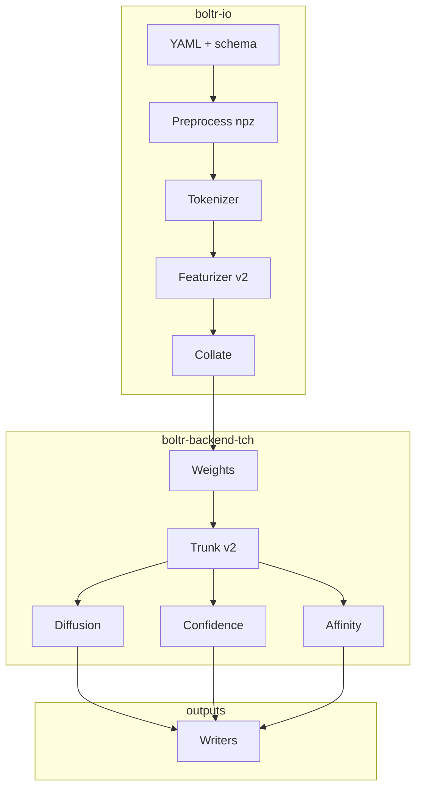

# Boltr — implementation backlog (checkpoint)

Rust port of **Boltz2** inference (`boltz-reference/`) using **`tch-rs` + LibTorch** (CPU or CUDA). This file is the **master checklist**; narrative history: **[docs/activity.md](docs/activity.md)**. Rolling featurizer notes: **[tasks/todo.md](tasks/todo.md)**.

**Parity target:** PyTorch **fallback** path (`use_kernels=False`). Prefer **golden tensors** vs Python on fixed fixtures before marking work complete.

**Also read:** [README.md](README.md), [QUICKSTART.md](QUICKSTART.md), [DEVELOPMENT.md](DEVELOPMENT.md), [docs/TENSOR_CONTRACT.md](docs/TENSOR_CONTRACT.md), [docs/NUMERICAL_TOLERANCES.md](docs/NUMERICAL_TOLERANCES.md), [docs/PYTHON_REMOVAL.md](docs/PYTHON_REMOVAL.md), [docs/PAIRFORMER_IMPLEMENTATION.md](docs/PAIRFORMER_IMPLEMENTATION.md), [boltz-reference/docs/prediction.md](boltz-reference/docs/prediction.md).

---

## How to use this checklist

| Mark | Meaning |
|------|---------|
| `[x]` | **Done** — golden test, integration test, or signed-off scope. |
| `[~]` | **Partial / stub** — implemented but not full parity, placeholder backend, or golden incomplete. |
| `[ ]` | **Open** — not started or blocked upstream. |

Update the mark in your PR when you complete a row (`[ ]` → `[~]` → `[x]` as appropriate).

---

## 1. Parity rules (non-negotiable)

| Topic | Rule |
|--------|------|
| Reference CLI | Upstream Boltz `src/boltz/main.py` ([jwohlwend/boltz](https://github.com/jwohlwend/boltz)) — URLs, preprocess, datamodules, writers. Vendored `boltz-reference/` is model-only (no `main.py`). |
| Checkpoint | `.ckpt` → [scripts/export_checkpoint_to_safetensors.py](scripts/export_checkpoint_to_safetensors.py); Rust loads `.safetensors` into `tch` (names match after strip-prefix). |
| Triangle / pair ops | Match PyTorch fallback ([triangular_mult.py](boltz-reference/src/boltz/model/layers/triangular_mult.py), triangular_attention without cuequivariance). |
| Mixed precision | Mirror Python `autocast("cuda", enabled=False)` islands; explicit F32 where Python disables autocast. |
| Tests | Golden tensors or explicit v1 scope sign-off. |

---

## 2. Dependency order

---

## 2b. `boltr-io` featurizer + collate — ordered plan

Single path for preprocess → features → batch. See also [`.cursor/plans/featurizer_collate_parity_e7ccf120.plan.md`](.cursor/plans/featurizer_collate_parity_e7ccf120.plan.md).

| Order | Deliverable | Status | Notes |
|-------|-------------|--------|--------|
| **1** | `pad_to_max` + inference `collate` | [x] | [collate_pad.rs](boltr-io/src/collate_pad.rs); [INFERENCE_COLLATE_EXCLUDED_KEYS](boltr-io/src/feature_batch.rs). |
| **2** | `construct_paired_msa` + `process_msa_features` + golden | [x] | [msa_pairing.rs](boltr-io/src/featurizer/msa_pairing.rs), [process_msa_features.rs](boltr-io/src/featurizer/process_msa_features.rs), [msa_features_from_inference_input](boltr-io/src/inference_dataset.rs). Golden: [dump_msa_features_golden.py](scripts/dump_msa_features_golden.py), [msa_features_golden.rs](boltr-io/src/featurizer/msa_features_golden.rs). |
| **3a** | Dummy templates + merged `FeatureBatch` (token + MSA + atoms) | [x] | [dummy_templates.rs](boltr-io/src/featurizer/dummy_templates.rs); [trunk_smoke_feature_batch_from_inference_input](boltr-io/src/inference_dataset.rs) incl. [atom_features_from_inference_input](boltr-io/src/inference_dataset.rs). Test: [load_input_dataset.rs](boltr-io/tests/load_input_dataset.rs). |
| **3b** | Real `process_template_features` | [x] | [process_template_features.rs](boltr-io/src/featurizer/process_template_features.rs), [`template_features_from_tokenized`](boltr-io/src/inference_dataset.rs); manifest template keys; `ChainRow.name` for alignment. Includes `template_force` / `template_force_threshold` ([dummy_templates.rs](boltr-io/src/featurizer/dummy_templates.rs)). |
| **4** | `process_atom_features` | [x] | Rust + [inference merge](boltr-io/src/inference_dataset.rs); ALA allclose all keys ([atom_features_golden.rs](boltr-io/src/featurizer/atom_features_golden.rs)). **TBD:** multi-residue / ligands via [AtomRefDataProvider](boltr-io/src/featurizer/process_atom_features.rs) + additional goldens. |
| **5** | §4.4 collate acceptance (full dict) | [x] | [post_collate_golden.rs](boltr-io/tests/post_collate_golden.rs) per-key `allclose` vs [trunk_smoke_collate.safetensors](boltr-io/tests/fixtures/collate_golden/trunk_smoke_collate.safetensors); regen: `cargo run -p boltr-io --bin write_trunk_collate_from_fixture`. [collate_two_msa_golden](boltr-io/tests/fixtures/collate_golden/collate_two_msa_golden.safetensors) exercises `pad_to_max` on `msa`. |

*Follow-ups (scheduled elsewhere): optional Python↔Rust cross-check goldens; symmetry/constraint fixtures with real CCD/ligand maps at scale.*

---

## 3. Tooling, build, and CI

| Status | Task | Details |
|--------|------|---------|
| [x] | LibTorch build matrix | [DEVELOPMENT.md](DEVELOPMENT.md); `scripts/bootstrap_dev_venv.sh`, [scripts/cargo-tch](scripts/cargo-tch), [scripts/with_dev_venv.sh](scripts/with_dev_venv.sh), [scripts/check_tch_prereqs.sh](scripts/check_tch_prereqs.sh). |
| [x] | CLI device flags | `--device`, `BOLTR_DEVICE`; CUDA check in backend. |
| [x] | Default feature policy | `default = []` on `boltr-cli`; `--features tch` documented. |
| [x] | Optional CUDA CI job | [`.github/workflows/libtorch-backend-smoke.yml`](.github/workflows/libtorch-backend-smoke.yml) (`workflow_dispatch`). |
| [x] | Checkpoint export automation | [Makefile](Makefile); [scripts/compare_ckpt_safetensors_counts.py](scripts/compare_ckpt_safetensors_counts.py). |
| [x] | Hyperparameter manifest | [export_hparams_from_ckpt.py](scripts/export_hparams_from_ckpt.py) exports full Lightning `hyper_parameters` JSON; [Boltz2Hparams](boltr-backend-tch/src/boltz_hparams.rs) + [`from_lightning_hyper_parameters_json`](boltr-backend-tch/src/boltz_hparams.rs) alias; nested args + `serde` flatten `other`. |

**Acceptance:** Clone → `cargo test` (no GPU); optional GPU per DEVELOPMENT.md.

---

## 4. `boltr-io`: input, preprocess, features

### 4.1 YAML and chemistry (Boltz schema)

| Status | Task | Python reference | Deliverables |
|--------|------|------------------|--------------|
| [x] | Boltz YAML → typed config | `parse/yaml.py`, `parse/schema.py` | [config.rs](boltr-io/src/config.rs) — `BoltzInput`: protein/dna/rna polymers, ligands (`smiles` / `ccd`), `ChainIdSpec`, modifications, cyclic, `constraints` (`bond` / `pocket` / `contact`), `templates` (cif/pdb), `properties` (`affinity`). [parser.rs](boltr-io/src/parser.rs) `parse_input_path` / `parse_input_str`. Tests: [yaml_parse.rs](boltr-io/tests/yaml_parse.rs), doc example in `config.rs`. |
| [x] | CCD / molecules (Rust graph) | `mol.py` | [ccd.rs](boltr-io/src/ccd.rs) — `CcdMolData`, `CcdAtom`, `CcdBond`, `CcdMolProvider`; load from pre-extracted `mols/{code}.json` (RDKit `.pkl` not deserialized in Rust). Re-exported from [lib.rs](boltr-io/src/lib.rs). |
| [x] | Structure I/O (inference path) | `types.py` StructureV2, preprocess | **Read:** [structure_v2.rs](boltr-io/src/structure_v2.rs) tables + [structure_v2_npz.rs](boltr-io/src/structure_v2_npz.rs) `read_structure_v2_npz_*` (preprocess `.npz`). **Write:** [write/mmcif.rs](boltr-io/src/write/mmcif.rs), [write/pdb.rs](boltr-io/src/write/pdb.rs) from `StructureV2Tables`. Raw mmCIF/PDB **ingest** for new targets remains in Python preprocess (not duplicated here). |
| [x] | Residue constraints NPZ → Rust | preprocess `main.py` | [residue_constraints.rs](boltr-io/src/residue_constraints.rs) — `ResidueConstraints::load_from_npz` / `load_from_npz_bytes` (ZIP+`.npy` layout). [load_input](boltr-io/src/inference_dataset.rs) accepts `constraints_dir` and attaches `residue_constraints` to `Boltz2InferenceInput`. Layout checker: [verify_constraints_npz_layout.py](scripts/verify_constraints_npz_layout.py). E2E: [integration_smoke.rs](boltr-io/tests/integration_smoke.rs). |
| [x] | Optional gaps | — | **Not in Rust:** Python-only `schema.py` cross-entity validation; RDKit SMILES→mol at parse time. **`extra_mols` in Rust:** optional `extra_mols_dir` with CCD JSON from extracted pickle cache ([`CcdMolProvider`](boltr-io/src/ccd.rs)). **Done:** YAML serde round-trip test ([`yaml_parse.rs`](boltr-io/tests/yaml_parse.rs) `yaml_roundtrip_minimal_protein_only`). Larger Python↔Rust fixtures remain optional. |

### 4.2 MSA

| Status | Task | Python reference | Deliverables |
|--------|------|------------------|--------------|
| [x] | ColabFold / MSA server | `msa/mmseqs2.py` | [boltr-io/src/msa.rs](boltr-io/src/msa.rs). |
| [x] | MSA file formats | `parse/a3m.py`, `parse/csv.py` | [a3m.rs](boltr-io/src/a3m.rs), [msa_csv.rs](boltr-io/src/msa_csv.rs). |
| [x] | MSA → npz | `main.py`, `types.py` | [msa_npz.rs](boltr-io/src/msa_npz.rs); CLI `boltr msa-to-npz` ([boltr-cli/src/main.rs](boltr-cli/src/main.rs)). |

### 4.3 Tokenizer (Boltz2)

| Status | Task | Python reference | Deliverables |
|--------|------|------------------|--------------|
| [x] | `Boltz2Tokenizer` / core tokenize | `tokenize/boltz2.py` | [tokenize/boltz2.rs](boltr-io/src/tokenize/boltz2.rs), [`tokenize_boltz2_inference`](boltr-io/src/inference_dataset.rs) + [`TokenizeBoltz2Input`](boltr-io/src/inference_dataset.rs). Tests: preprocess [`load_input_smoke`](boltr-io/tests/fixtures/load_input_smoke) + template loop parity. |
| [x] | Token/atom bookkeeping | `types.py` (`TokenV2`) | [token_npz.rs](boltr-io/src/token_npz.rs), [token_v2_numpy.rs](boltr-io/src/token_v2_numpy.rs) — packed `TokenV2` rows (`TOKEN_V2_NUMPY_ITEMSIZE=164`, `|V164` `t_tokens_v2.npy`); `boltr tokens-to-npz`. |

### 4.4 Featurizer (Boltz2)

| Status | Task | Python reference | Deliverables |
|--------|------|------------------|--------------|
| [x] | Constants / enums | `data/const.py` | [boltz_const.rs](boltr-io/src/boltz_const.rs) (`OUT_TYPES`, weights, `clash_type_for_chain_pair`, `CANONICAL_TOKENS`, inverse letter ids), [ref_atoms.rs](boltr-io/src/ref_atoms.rs), [vdw_radii.rs](boltr-io/src/vdw_radii.rs), [ligand_exclusion.rs](boltr-io/src/ligand_exclusion.rs), [ambiguous_atoms.rs](boltr-io/src/ambiguous_atoms.rs). |
| [x] | `process_token_features` (inference) | `featurizerv2.py` | [process_token_features.rs](boltr-io/src/featurizer/process_token_features.rs); golden [token_features_golden.rs](boltr-io/src/featurizer/token_features_golden.rs). |
| [x] | `process_atom_features` | same | [process_atom_features.rs](boltr-io/src/featurizer/process_atom_features.rs); inference [atom_features_from_inference_input](boltr-io/src/inference_dataset.rs). Golden ALA allclose — [atom_features_golden.rs](boltr-io/src/featurizer/atom_features_golden.rs). |
| [x] | `process_msa_features` (+ affinity embedder inputs) | same | [process_msa_features.rs](boltr-io/src/featurizer/process_msa_features.rs); when manifest has affinity, [`msa_features_from_inference_input`](boltr-io/src/inference_dataset.rs) adds `profile_affinity` / `deletion_mean_affinity` (second pass on cropped tokens). |
| [x] | `process_template_features` | same | [process_template_features.rs](boltr-io/src/featurizer/process_template_features.rs) + [`template_features_from_tokenized`](boltr-io/src/inference_dataset.rs); [dummy_templates.rs](boltr-io/src/featurizer/dummy_templates.rs) incl. `template_force` / `template_force_threshold`. |
| [x] | Ensemble / symmetry / constraints | same + `symmetry.py` | [`process_ensemble_features`](boltr-io/src/featurizer/process_ensemble_features.rs); [`process_symmetry_features`](boltr-io/src/featurizer/process_symmetry_features.rs); [`get_ligand_symmetries_for_tokens`](boltr-io/src/featurizer/process_symmetry_features.rs) + optional map; [`process_residue_constraint_features`](boltr-io/src/featurizer/process_residue_constraint_features.rs) + NPZ load via `load_input`. **TBD:** optional Python↔Rust cross-golden on a larger ligand+constraints fixture. |
| [x] | Padding for inference collate | `pad.py` | [collate_pad.rs](boltr-io/src/collate_pad.rs), [pad.rs](boltr-io/src/pad.rs). |

**Acceptance (§4.4):** Rust-native trunk collate → checked-in `trunk_smoke_collate.safetensors` with per-key numeric parity ([post_collate_golden.rs](boltr-io/tests/post_collate_golden.rs)). **Also done:** token (ALA), MSA (smoke), atom features (ALA), template + template-force keys, `collate_two_msa` pad test.

### 4.5 Inference dataset / collate

| Status | Task | Python reference | Deliverables |
|--------|------|------------------|--------------|
| [x] | `load_input` | `inferencev2.py` | [inference_dataset.rs](boltr-io/src/inference_dataset.rs): `ResidueConstraints` from `constraints_dir`; `extra_mols` via [`CcdMolProvider::load_all_json_in_dir`](boltr-io/src/ccd.rs) when `extra_mols_dir` is set (JSON extracted from Boltz pickle cache). |
| [x] | `collate` | same | [feature_batch.rs](boltr-io/src/feature_batch.rs), [collate_pad.rs](boltr-io/src/collate_pad.rs), [manifest.json](boltr-io/tests/fixtures/collate_golden/manifest.json). [post_collate_golden.rs](boltr-io/tests/post_collate_golden.rs): per-key `allclose` vs Rust-generated [trunk_smoke_collate.safetensors](boltr-io/tests/fixtures/collate_golden/trunk_smoke_collate.safetensors) (`write_trunk_collate_from_fixture`). |
| [x] | Affinity crop | `crop/affinity.py` | [crop_affinity.rs](boltr-io/src/featurizer/crop_affinity.rs): `AffinityCropper` (upstream distance / chain neighborhood / `max_tokens_protein` / `max_atoms`) + `AffinityTokenized`; tests in-module. Optional cross-check vs Python export if needed. |

### 4.6 Output writers

| Status | Task | Python reference | Deliverables |
|--------|------|------------------|--------------|
| [x] | `BoltzWriter` (confidence JSON + paths + tensor npz) | [prediction.md](boltz-reference/docs/prediction.md) (output tree); [`boltz2.py` `predict_step`](boltz-reference/src/boltz/model/models/boltz2.py) (tensors). Full Boltz `data/write/writer.py` is **not** vendored here. | [write/writer.rs](boltr-io/src/write/writer.rs): [`ConfidenceSummary`](boltr-io/src/write/writer.rs), [`write_confidence_json`](boltr-io/src/write/writer.rs), [`PredictionFileNames`](boltr-io/src/write/writer.rs) (incl. `pae`/`pde`/`plddt` paths). [write/prediction_npz.rs](boltr-io/src/write/prediction_npz.rs): [`write_pae_npz`](boltr-io/src/write/prediction_npz.rs), [`write_pde_npz`](boltr-io/src/write/prediction_npz.rs), [`write_plddt_npz`](boltr-io/src/write/prediction_npz.rs) (`numpy.savez_compressed`-style keys `pae` / `pde` / `plddt`). **TBD:** Lightning callback (caller-side), embeddings npz (Python-only I/O). |
| [x] | `BoltzAffinityWriter` | [prediction.md](boltz-reference/docs/prediction.md) affinity JSON | [write/affinity_writer.rs](boltr-io/src/write/affinity_writer.rs): [`AffinitySummary`](boltr-io/src/write/affinity_writer.rs), [`write_affinity_json`](boltr-io/src/write/affinity_writer.rs). |
| [x] | Structure formats | [prediction.md](boltz-reference/docs/prediction.md) (`--output_format`); no `pdb.py`/`mmcif.py` in-tree | [write/pdb.rs](boltr-io/src/write/pdb.rs) [`structure_v2_to_pdb`](boltr-io/src/write/pdb.rs), [write/mmcif.rs](boltr-io/src/write/mmcif.rs) [`structure_v2_to_mmcif`](boltr-io/src/write/mmcif.rs) (minimal `_atom_site`; **not** full ModelCIF / `ihm`). Spec tests for PDB CONECT + mmCIF columns; **TBD:** byte-for-byte parity vs upstream Boltz if needed. |

---

## 5. `boltr-backend-tch`: Boltz2 model graph

### 5.1 Infrastructure

| Status | Task | Deliverables |
|--------|------|--------------|
| [x] | Device + CUDA check | [device.rs](boltr-backend-tch/src/device.rs) |
| [x] | Safetensors load | [checkpoint.rs](boltr-backend-tch/src/checkpoint.rs) |
| [x] | Full `VarStore` mapping | Smoke [boltz2_smoke.safetensors](boltr-backend-tch/tests/fixtures/boltz2_smoke/boltz2_smoke.safetensors); inference taxonomy [`inference_keys.rs`](boltr-backend-tch/src/inference_keys.rs); [`Boltz2Model::load_from_safetensors_strict`](boltr-backend-tch/src/boltz2/model.rs) / [`verify_boltz2_safetensors --reject-unused-file-keys`](boltr-backend-tch/src/bin/verify_boltz2_safetensors.rs) for no-extra-keys strict pairing. |
| [x] | Config struct | [Boltz2Hparams](boltr-backend-tch/src/boltz_hparams.rs): nested `embedder_args` / `msa_args` / `training_args` / … + [`serde` flatten `other`](boltr-backend-tch/src/boltz_hparams.rs); fixtures [minimal.json](boltr-backend-tch/tests/fixtures/hparams/minimal.json), [sample_full.json](boltr-backend-tch/tests/fixtures/hparams/sample_full.json). Extra Lightning keys land in `other` without per-field structs for every Python-only knob. |

### 5.2 Embeddings and trunk input

| Status | Task | Deliverables |
|--------|------|--------------|
| [x] | `InputEmbedder` | [input_embedder.rs](boltr-backend-tch/src/boltz2/input_embedder.rs) — full `AtomEncoder` → `atom_enc_proj_z` → `AtomAttentionEncoder` → token linears (`InputEmbedder::new`). Opt-in Python golden: `BOLTR_RUN_INPUT_EMBEDDER_GOLDEN=1`, [input_embedder_golden.rs](boltr-backend-tch/tests/input_embedder_golden.rs). |
| [x] | `RelativePositionEncoder` | [relative_position.rs](boltr-backend-tch/src/boltz2/relative_position.rs) — forward + cyclic branch test. Opt-in golden: `BOLTR_RUN_TRUNK_INIT_GOLDEN=1`, [trunk_init_golden.rs](boltr-backend-tch/tests/trunk_init_golden.rs). |
| [x] | `s_init`, `z_init_*`, bonds, contact conditioning | [model.rs](boltr-backend-tch/src/boltz2/model.rs) — `forward_trunk_with_z_init_terms` (`z_pair` + `rel_pos` + `token_bonds` + `contact`); unit tests `trunk_forward_with_token_bonds_and_types`, `trunk_forward_with_contact_conditioning`; trunk init goldens via [`trunk_init_golden.rs`](boltr-backend-tch/tests/trunk_init_golden.rs) (`rel_pos` + `s_init`). Optional per-slice safetensors for bonds/contact alone not required for parity gate. |
| [x] | LayerNorm / recycling projections | [trunk.rs](boltr-backend-tch/src/boltz2/trunk.rs) |
| [x] | Trunk wiring | `predict_step_trunk` / `predict_step_trunk_from_embedder` on [model.rs](boltr-backend-tch/src/boltz2/model.rs); always-on test `predict_step_trunk_from_embedder_matches_preembedded_s_inputs` (embedder → trunk = pre-embedded `s_inputs` path). Collate smoke: [collate_predict_trunk.rs](boltr-backend-tch/tests/collate_predict_trunk.rs). |

### 5.3 Templates

| Status | Task | Deliverables |
|--------|------|--------------|
| [x] | `TemplateV2Module` | Ported from [`trunkv2.py`](boltz-reference/src/boltz/model/modules/trunkv2.py). [template_module.rs](boltr-backend-tch/src/boltz2/template_module.rs): CB–CB distogram (pairwise L2 → linspace binning → one-hot), unit vectors from frame rotations (`R^T @ (ca_j − t_i)` + normalize), visibility-ID asym mask, res-type pairwise features, `a_proj` → `z_proj(z_norm(z))` + `PairformerNoSeqModule` stack → `v_norm` → template aggregation → `relu` + `u_proj`. |
| [x] | `PairformerNoSeqModule` | [pairformer_no_seq.rs](boltr-backend-tch/src/layers/pairformer_no_seq.rs): stack of `PairformerNoSeqLayer` (tri-mul-out/in, tri-att-start/end, transition), matching Python `PairformerNoSeqModule`. |
| [x] | Trunk + model wiring | `TrunkV2` now holds `Option<TemplateV2Module>` (created when `template_args` is `Some`). Template bias applied **before** MSA in the recycling loop, matching Python order. `Boltz2Model.predict_step_trunk(…, template_feats)` threads features through. Checkpoint key `template_module` added to [inference_keys.rs](boltr-backend-tch/src/inference_keys.rs). **TBD:** golden test (one forward pass vs Python on tiny batch; needs LibTorch). |

### 5.4 MSA module

| Status | Task | Deliverables |
|--------|------|--------------|
| [x] | `MSAModule` | [msa_module.rs](boltr-backend-tch/src/boltz2/msa_module.rs); golden [export_msa_module_golden.py](scripts/export_msa_module_golden.py), opt-in test `BOLTR_RUN_MSA_GOLDEN=1`. |

### 5.5 Pairformer stack

| Status | Task | Deliverables |
|--------|------|--------------|
| [x] | `PairformerModule` + attention + tri ops + transition + OPM | [layers/](boltr-backend-tch/src/layers/), [attention/](boltr-backend-tch/src/attention/) |
| [x] | Dropout / mask audit | Training mode support, slice-based masks, correct comparison, comprehensive tests (see [PAIRFORMER_DROPOUT_FIX.md](docs/PAIRFORMER_DROPOUT_FIX.md)) |
| [x] | Pairformer layer golden (opt-in) | `BOLTR_RUN_PAIRFORMER_GOLDEN=1`, [export_pairformer_golden.py](scripts/export_pairformer_golden.py) |

### 5.6 Diffusion conditioning + structure

| Status | Task | Deliverables |
|--------|------|--------------|
| [x] | `DiffusionConditioning` + `AtomDiffusion` (v2) + score model | Ported from [`diffusion_conditioning.py`](boltz-reference/src/boltz/model/modules/diffusion_conditioning.py) and [`diffusionv2.py`](boltz-reference/src/boltz/model/modules/diffusionv2.py). New files: [diffusion_conditioning.rs](boltr-backend-tch/src/boltz2/diffusion_conditioning.rs), [diffusion.rs](boltr-backend-tch/src/boltz2/diffusion.rs) (`DiffusionModule` score network + `AtomDiffusion` EDM sampler), [encoders.rs](boltr-backend-tch/src/boltz2/encoders.rs) (`FourierEmbedding`, `SingleConditioning`, `PairwiseConditioning`, `AtomEncoder`, `AtomAttentionEncoder`, `AtomAttentionDecoder`), [transformers.rs](boltr-backend-tch/src/boltz2/transformers.rs) (`AdaLN`, `ConditionedTransitionBlock`, `DiffusionTransformer`, `AtomTransformer`). Wired into [model.rs](boltr-backend-tch/src/boltz2/model.rs) with `forward_diffusion_conditioning`, `forward_diffusion_sample`, `predict_step_trunk`. **TBD:** golden test for one reverse-diffusion step vs Python on a tiny batch (needs LibTorch). |
| [x] | `DistogramModule`, optional `BFactorModule`, wiring | [distogram.rs](boltr-backend-tch/src/boltz2/distogram.rs): `DistogramModule(z + z^T → Linear → reshape)`, `BFactorModule(s → Linear)`. Wired into [model.rs](boltr-backend-tch/src/boltz2/model.rs) as `distogram_module` and optional `bfactor_module`; exposed via `forward_distogram()`, `forward_bfactor()`. Checkpoint keys added to [inference_keys.rs](boltr-backend-tch/src/inference_keys.rs). |

### 5.7 Confidence

| Status | Task | Deliverables |
|--------|------|--------------|
| [x] | `ConfidenceModule` v2 | [confidence.rs](boltr-backend-tch/src/boltz2/confidence.rs) + [confidence_utils.rs](boltr-backend-tch/src/boltz2/confidence_utils.rs) (`ConfidenceModule`, `ConfidenceHeads`, `compute_ptms`, `compute_aggregated_metric`; ligand `compute_frame_pred` stub). Optional `confidence_module` on [`Boltz2Model`](boltr-backend-tch/src/boltz2/model.rs); **`predict_step`** runs trunk → diffusion → distogram → confidence when enabled. |

### 5.8 Affinity

| Status | Task | Deliverables |
|--------|------|--------------|
| [x] | `AffinityModule`, MW correction | [affinity.rs](boltr-backend-tch/src/boltz2/affinity.rs): `AffinityModule`, `AffinityHeads`, `AffinityModuleConfig::from_affinity_model_args`, `apply_affinity_mw_correction` + `AFFINITY_MW_*` constants; **`Boltz2Model` affinity wiring** still pending featurizer path. |

### 5.9 Potentials / steering (optional)

| Status | Task | Note |
|--------|------|------|
| [x] | Inference potentials | [`SteeringParams`](boltr-backend-tch/src/boltz2/steering.rs), [`PotentialBatchFeats`](boltr-backend-tch/src/boltz2/potentials/feats.rs) + [`get_potentials_boltz2`](boltr-backend-tch/src/boltz2/potentials/registry.rs); extended [`AtomDiffusion::sample_with_steering`](boltr-backend-tch/src/boltz2/diffusion.rs); [`Boltz2Model::predict_step`](boltr-backend-tch/src/boltz2/model.rs) / `forward_diffusion_sample` threading; CLI `--use-potentials`. FK resampling still partial. |

### 5.10 Top-level forward

| Status | Task | Deliverables |
|--------|------|--------------|
| [x] | Trunk-only predict | [predict_step_trunk](boltr-backend-tch/src/boltz2/model.rs) — recycling + trunk + optional MSA; template stub. |
| [x] | Full `predict_step` | [`predict_step`](boltr-backend-tch/src/boltz2/model.rs) — trunk + diffusion + distogram + optional confidence + optional affinity ([`PredictStepOutput`](boltr-backend-tch/src/boltz2/model.rs)); trunk uses `token_pad_mask` ([`TrunkV2`](boltr-backend-tch/src/boltz2/trunk.rs)). |
| [x] | `predict_args` / recycling parity | [`Boltz2PredictArgs`](boltr-backend-tch/src/predict_args.rs), [`resolve_predict_args`](boltr-backend-tch/src/predict_args.rs) (CLI → YAML → checkpoint → defaults). |
| [x] | CLI → writers | `boltr predict` writes `boltr_predict_args.json` (tch); `--spike-only` for trunk smoke. **Done:** when `manifest.json` + preprocess `.npz` sit next to the input YAML, [`predict_tch`](boltr-cli/src/predict_tch.rs) runs `load_input` → collate → `predict_step` → structure PDB/mmCIF via [`collate_predict_bridge`](boltr-cli/src/collate_predict_bridge.rs) + [`StructureV2Tables::apply_predicted_atom_coords`](boltr-io/src/structure_v2.rs). Confidence/npz writers still depend on loaded confidence heads. |

---

## 6. `boltr-cli`: user-facing commands

| Status | Task | Details |
|--------|------|---------|
| [x] | `download` | Checkpoints + ccd + mols URLs aligned with `main.py`. `--cache-dir` flag; `BOLTZ_CACHE` env var support. |
| [x] | `predict` | Parses YAML, optional MSA, summary JSON, **`boltr_predict_args.json`** (tch), optional **`--spike-only`** trunk smoke; checkpoint resolution + model building + weight loading + output directory layout matching Boltz `predictions/`. Full `predict_step` when preprocess+I/O land. |
| [x] | Flags parity | **`--recycling-steps`**, **`--sampling-steps`**, **`--diffusion-samples`**, **`--max-parallel-samples`**, **`--step-scale`** (default 1.638), **`--output-format`** (mmcif/pdb), **`--max-msa-seqs`** (default 8192), **`--spike-only`**; **`--checkpoint`**, **`--affinity-checkpoint`**, **`--affinity-mw-correction`**, **`--sampling-steps-affinity`**, **`--diffusion-samples-affinity`**, **`--preprocessing-threads`**, **`--override`**, **`--write-full-pae`**, **`--write-full-pde`**; potentials (`--use-potentials`), affinity (`--affinity`). **`BOLTR_DEVICE`** / **`BOLTR_CACHE`** env vars. |
| [x] | `eval` | Stub with clear documentation pointing to [boltz-reference/docs/evaluation.md](boltz-reference/docs/evaluation.md). |
| [x] | Tests | 9/9 passing (`cargo test -p boltr-cli`): predict summary JSON, predict CLI with flags, help output verification, download help, MSA/tokens CLI roundtrips. |

---

## 7. Testing strategy (cross-cutting)

| Status | Task | Details |
|--------|------|---------|
| [x] | Golden fixture layout | [boltr-io/tests/fixtures/README.md](boltr-io/tests/fixtures/README.md), [load_input_smoke/README.md](boltr-io/tests/fixtures/load_input_smoke/README.md); [boltr-backend-tch/tests/fixtures/README.md](boltr-backend-tch/tests/fixtures/README.md). |
| [x] | Python export scripts | Indexed in [scripts/README.md](scripts/README.md). Optional manual workflow: [.github/workflows/dump-full-collate-golden.yml](.github/workflows/dump-full-collate-golden.yml) (documents `dump_full_collate_golden.py` prerequisites; full upstream Boltz not in CI). |
| [x] | Numerical tolerances | [docs/NUMERICAL_TOLERANCES.md](docs/NUMERICAL_TOLERANCES.md) (registry); [docs/TENSOR_CONTRACT.md](docs/TENSOR_CONTRACT.md) §6.5 summary. |
| [x] | Regression harness | [scripts/regression_compare_predict.sh](scripts/regression_compare_predict.sh) + [scripts/regression_compare_outputs.py](scripts/regression_compare_outputs.py); prerequisites, `BOLTR_REGRESSION_TOL_FILE`, [scripts/regression_tol.env.example](scripts/regression_tol.env.example); gated `BOLTR_REGRESSION=1`. |
| [x] | Backend unit tests | [scripts/cargo-tch](scripts/cargo-tch) documents `--test collate_predict_trunk` and goldens; [collate_predict_trunk.rs](boltr-backend-tch/tests/collate_predict_trunk.rs). CI: [boltr-io-test.yml](.github/workflows/boltr-io-test.yml) for `boltr-io`. |

---

## 8. Python removal (gated)

Do **not** delete `boltz-reference/` until Rust replaces slices with tests. See [docs/PYTHON_REMOVAL.md](docs/PYTHON_REMOVAL.md).

| Milestone | Action |
|-----------|--------|
| Featurizer goldens sufficient | Trim redundant docs only. |
| Full predict parity on fixtures | Pin or submodule upstream. |
| Long-term | Minimal Python for export/regression. |

---

## 9. Parallel workstreams

1. **Featurizer:** §2b **5** trunk collate golden done (Rust-native); continue atom/featurizer goldens on larger fixtures as needed.
2. **Trunk:** Full embedder, real TemplateModule, VarStore audit; feed [trunk_smoke_feature_batch_from_inference_input](boltr-io/src/inference_dataset.rs).
3. **Diffusion:** §5.6 — blocked on trunk tensor contract.
4. **Writers:** §4.6 — can start from Python dumps.
5. **Affinity:** §5.8 — blocked on affinity featurizer path.

---

## 10. Quick reference — Python files (inference parity)

**Must-have:** `main.py`, `data/module/inferencev2.py`, `data/feature/featurizerv2.py`, `data/tokenize/boltz2.py`, `data/types.py`, `data/const.py`, `data/pad.py`, `data/mol.py`, `model/models/boltz2.py`, `model/modules/trunkv2.py`, `diffusionv2.py`, `diffusion_conditioning.py`, `confidencev2.py`, `affinity.py`, `encodersv2.py`, `transformersv2.py`, `model/layers/pairformer.py`, attention / triangular / transition / outer_product_mean, `data/write/writer.py`.

**Training-only / lower v1 priority:** `training*`, `sample/*`, most of `loss/*`, `optim/*`.

---

*Last updated: 2026-03-29 — Cleared remaining `[~]` rows (hparams, preprocess bridge, verify strict, CI docs, YAML round-trip).*
