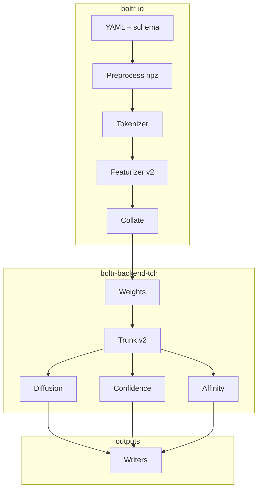

# Boltr — implementation backlog (checkpoint)

Rust port of **Boltz2** inference (`boltz-reference/`) using **`tch-rs` + LibTorch** (CPU or CUDA). This file is the **master checklist**; narrative history: **[docs/activity.md](docs/activity.md)**. Rolling featurizer notes: **[tasks/todo.md](tasks/todo.md)**.

**Parity target:** PyTorch **fallback** path (`use_kernels=False`). Prefer **golden tensors** vs Python on fixed fixtures before marking work complete.

**Also read:** [DEVELOPMENT.md](DEVELOPMENT.md), [docs/TENSOR_CONTRACT.md](docs/TENSOR_CONTRACT.md), [docs/PYTHON_REMOVAL.md](docs/PYTHON_REMOVAL.md), [docs/PAIRFORMER_IMPLEMENTATION.md](docs/PAIRFORMER_IMPLEMENTATION.md), [boltz-reference/docs/prediction.md](boltz-reference/docs/prediction.md).

---

## How to use this checklist

| Mark | Meaning |
|------|---------|
| `[x]` | **Done** — golden test, integration test, or signed-off scope. |
| `[~]` | **Partial / stub** — implemented but not full parity, placeholder backend, or golden incomplete. |
| `[ ]` | **Open** — not started or blocked upstream. |

Update the mark in your PR when you complete a row (`[ ]` → `[~]` → `[x]` as appropriate).

---

## 1. Parity rules (non-negotiable)

| Topic | Rule |
|--------|------|
| Reference CLI | `boltz-reference/src/boltz/main.py` — URLs, preprocess, datamodules, writers. |
| Checkpoint | `.ckpt` → [scripts/export_checkpoint_to_safetensors.py](scripts/export_checkpoint_to_safetensors.py); Rust loads `.safetensors` into `tch` (names match after strip-prefix). |
| Triangle / pair ops | Match PyTorch fallback ([triangular_mult.py](boltz-reference/src/boltz/model/layers/triangular_mult.py), triangular_attention without cuequivariance). |
| Mixed precision | Mirror Python `autocast("cuda", enabled=False)` islands; explicit F32 where Python disables autocast. |
| Tests | Golden tensors or explicit v1 scope sign-off. |

---

## 2. Dependency order

---

## 2b. `boltr-io` featurizer + collate — ordered plan

Single path for preprocess → features → batch. See also [`.cursor/plans/featurizer_collate_parity_e7ccf120.plan.md`](.cursor/plans/featurizer_collate_parity_e7ccf120.plan.md).

| Order | Deliverable | Status | Notes |
|-------|-------------|--------|--------|
| **1** | `pad_to_max` + inference `collate` | [x] | [collate_pad.rs](boltr-io/src/collate_pad.rs); [INFERENCE_COLLATE_EXCLUDED_KEYS](boltr-io/src/feature_batch.rs). |
| **2** | `construct_paired_msa` + `process_msa_features` + golden | [x] | [msa_pairing.rs](boltr-io/src/featurizer/msa_pairing.rs), [process_msa_features.rs](boltr-io/src/featurizer/process_msa_features.rs), [msa_features_from_inference_input](boltr-io/src/inference_dataset.rs). Golden: [dump_msa_features_golden.py](scripts/dump_msa_features_golden.py), [msa_features_golden.rs](boltr-io/src/featurizer/msa_features_golden.rs). |
| **3a** | Dummy templates + merged `FeatureBatch` (token + MSA + atoms) | [x] | [dummy_templates.rs](boltr-io/src/featurizer/dummy_templates.rs); [trunk_smoke_feature_batch_from_inference_input](boltr-io/src/inference_dataset.rs) incl. [atom_features_from_inference_input](boltr-io/src/inference_dataset.rs). Test: [load_input_dataset.rs](boltr-io/tests/load_input_dataset.rs). |
| **3b** | Real `process_template_features` | [ ] | Needs `template_tokens` + [featurizerv2.py](boltz-reference/src/boltz/data/feature/featurizerv2.py) ~1696+. |
| **4** | `process_atom_features` | [~] | Rust + [inference merge](boltr-io/src/inference_dataset.rs); partial allclose ([atom_features_golden.rs](boltr-io/src/featurizer/atom_features_golden.rs), skip list for RDKit/geometry). **TBD:** full-key allclose on same NPZ + mols; ligands via [AtomRefDataProvider](boltr-io/src/featurizer/process_atom_features.rs). |
| **5** | §4.4 collate acceptance (full dict) | [~] | [collate_two_msa_golden](boltr-io/tests/fixtures/collate_golden/collate_two_msa_golden.safetensors) vs [collate_inference_batches](boltr-io/src/collate_pad.rs). **TBD:** full trunk post-collate `allclose`. |

*Out of scope for this track unless scheduled: affinity MSA variant, symmetry/ensemble/constraint maps, affinity crop.*

---

## 3. Tooling, build, and CI

| Status | Task | Details |
|--------|------|---------|
| [x] | LibTorch build matrix | [DEVELOPMENT.md](DEVELOPMENT.md); `scripts/bootstrap_dev_venv.sh`, [scripts/cargo-tch](scripts/cargo-tch), [scripts/with_dev_venv.sh](scripts/with_dev_venv.sh), [scripts/check_tch_prereqs.sh](scripts/check_tch_prereqs.sh). |
| [x] | CLI device flags | `--device`, `BOLTR_DEVICE`; CUDA check in backend. |
| [x] | Default feature policy | `default = []` on `boltr-cli`; `--features tch` documented. |
| [x] | Optional CUDA CI job | [`.github/workflows/libtorch-backend-smoke.yml`](.github/workflows/libtorch-backend-smoke.yml) (`workflow_dispatch`). |
| [x] | Checkpoint export automation | [Makefile](Makefile); [scripts/compare_ckpt_safetensors_counts.py](scripts/compare_ckpt_safetensors_counts.py). |
| [~] | Hyperparameter manifest | [export_hparams_from_ckpt.py](scripts/export_hparams_from_ckpt.py) → JSON; [Boltz2Hparams](boltr-backend-tch/src/boltz_hparams.rs). **TBD:** full Lightning dict / single `from_config`. |

**Acceptance:** Clone → `cargo test` (no GPU); optional GPU per DEVELOPMENT.md.

---

## 4. `boltr-io`: input, preprocess, features

### 4.1 YAML and chemistry (Boltz schema)

| Status | Task | Python reference | Deliverables |
|--------|------|------------------|--------------|
| [x] | Minimal YAML types | `parse/yaml.py`, `parse/schema.py` | [boltr-io/src/config.rs](boltr-io/src/config.rs) — constraints, templates, properties.affinity, modifications, cyclic. |
| [ ] | Full schema parse | `schema.py` | Entities, bonds, ligands (SMILES/CCD). **Depends on:** CCD/molecules. |
| [ ] | CCD / molecules | `mol.py`, `main.py` | `ccd.pkl`, `mols.tar`; ligand graphs for featurizer. |
| [ ] | Structure parsers | `parse/mmcif.py`, `parse/pdb.py` | Parse inputs for templates / processed structures. |
| [~] | Constraints serialization | preprocess `main.py` | [verify_constraints_npz_layout.py](scripts/verify_constraints_npz_layout.py). **TBD:** Rust `npz` → typed structs in `load_input`. |

### 4.2 MSA

| Status | Task | Python reference | Deliverables |
|--------|------|------------------|--------------|
| [x] | ColabFold / MSA server | `msa/mmseqs2.py` | [boltr-io/src/msa.rs](boltr-io/src/msa.rs). |
| [x] | MSA file formats | `parse/a3m.py`, `parse/csv.py` | [a3m.rs](boltr-io/src/a3m.rs), [msa_csv.rs](boltr-io/src/msa_csv.rs). |
| [x] | MSA → npz | `main.py`, `types.py` | [msa_npz.rs](boltr-io/src/msa_npz.rs); CLI `boltr msa-to-npz` ([boltr-cli/src/main.rs](boltr-cli/src/main.rs)). |

### 4.3 Tokenizer (Boltz2)

| Status | Task | Python reference | Deliverables |
|--------|------|------------------|--------------|
| [x] | `Boltz2Tokenizer` / core tokenize | `tokenize/boltz2.py` | [tokenize/boltz2.rs](boltr-io/src/tokenize/boltz2.rs), [`tokenize_boltz2_inference`](boltr-io/src/inference_dataset.rs) + [`TokenizeBoltz2Input`](boltr-io/src/inference_dataset.rs). Tests: preprocess [`load_input_smoke`](boltr-io/tests/fixtures/load_input_smoke) + template loop parity. |
| [x] | Token/atom bookkeeping | `types.py` (`TokenV2`) | [token_npz.rs](boltr-io/src/token_npz.rs), [token_v2_numpy.rs](boltr-io/src/token_v2_numpy.rs) — packed `TokenV2` rows (`TOKEN_V2_NUMPY_ITEMSIZE=164`, `|V164` `t_tokens_v2.npy`); `boltr tokens-to-npz`. |

### 4.4 Featurizer (Boltz2)

| Status | Task | Python reference | Deliverables |
|--------|------|------------------|--------------|
| [x] | Constants / enums | `data/const.py` | [boltz_const.rs](boltr-io/src/boltz_const.rs) (`OUT_TYPES`, weights, `clash_type_for_chain_pair`, `CANONICAL_TOKENS`, inverse letter ids), [ref_atoms.rs](boltr-io/src/ref_atoms.rs), [vdw_radii.rs](boltr-io/src/vdw_radii.rs), [ligand_exclusion.rs](boltr-io/src/ligand_exclusion.rs), [ambiguous_atoms.rs](boltr-io/src/ambiguous_atoms.rs). |
| [x] | `process_token_features` (inference) | `featurizerv2.py` | [process_token_features.rs](boltr-io/src/featurizer/process_token_features.rs); golden [token_features_golden.rs](boltr-io/src/featurizer/token_features_golden.rs). |
| [~] | `process_atom_features` | same | [process_atom_features.rs](boltr-io/src/featurizer/process_atom_features.rs); inference [atom_features_from_inference_input](boltr-io/src/inference_dataset.rs). Golden partial — [atom_features_golden.rs](boltr-io/src/featurizer/atom_features_golden.rs). |
| [x] | `process_msa_features` (non-affinity) | same | [process_msa_features.rs](boltr-io/src/featurizer/process_msa_features.rs). **TBD:** `affinity=True` MSA keys. |
| [~] | `process_template_features` | same | **[~] dummy:** [dummy_templates.rs](boltr-io/src/featurizer/dummy_templates.rs). **[ ] real:** `template_tokens` + `compute_template_features`. |
| [ ] | Ensemble / symmetry / constraints | same + `symmetry.py` | Optional inference flags. |
| [x] | Padding for inference collate | `pad.py` | [collate_pad.rs](boltr-io/src/collate_pad.rs), [pad.rs](boltr-io/src/pad.rs). |

**Acceptance (§4.4):** Frozen Python `collate` dict → Rust `allclose` per key. **Done:** token (ALA), MSA (smoke). **[~]:** atoms (partial allclose); **TBD:** full dict, real templates.

### 4.5 Inference dataset / collate

| Status | Task | Python reference | Deliverables |
|--------|------|------------------|--------------|
| [~] | `load_input` | `inferencev2.py` | [inference_dataset.rs](boltr-io/src/inference_dataset.rs). **TBD:** `ResidueConstraints`, `extra_mols` pickle. |
| [~] | `collate` | same | [feature_batch.rs](boltr-io/src/feature_batch.rs), [collate_pad.rs](boltr-io/src/collate_pad.rs), [manifest.json](boltr-io/tests/fixtures/collate_golden/manifest.json). **TBD:** full post-collate golden. |
| [ ] | Affinity crop | `crop/affinity.py` | If affinity inference parity required. |

### 4.6 Output writers

| Status | Task | Python reference | Deliverables |
|--------|------|------------------|--------------|
| [ ] | `BoltzWriter` | `write/writer.py` | Predictions layout, confidence outputs. |
| [ ] | `BoltzAffinityWriter` | same | Affinity outputs. |
| [ ] | Structure formats | `write/mmcif.py`, `write/pdb.py` | Consumer-compatible files. |

---

## 5. `boltr-backend-tch`: Boltz2 model graph

### 5.1 Infrastructure

| Status | Task | Deliverables |
|--------|------|--------------|
| [x] | Device + CUDA check | [device.rs](boltr-backend-tch/src/device.rs) |
| [x] | Safetensors load | [checkpoint.rs](boltr-backend-tch/src/checkpoint.rs) |
| [~] | Full `VarStore` mapping | Smoke [boltz2_smoke.safetensors](boltr-backend-tch/tests/fixtures/boltz2_smoke/boltz2_smoke.safetensors); **TBD:** full checkpoint allowlist. |
| [~] | Config struct | [Boltz2Hparams](boltr-backend-tch/src/boltz_hparams.rs) + JSON; **TBD:** full Lightning parity. |

### 5.2 Embeddings and trunk input

| Status | Task | Deliverables |
|--------|------|--------------|
| [~] | `InputEmbedder` | [input_embedder.rs](boltr-backend-tch/src/boltz2/input_embedder.rs) — partial (`res_type` + `msa_profile` + external `a`). **TBD:** AtomEncoder / AtomAttentionEncoder. |
| [~] | `RelativePositionEncoder` | [relative_position.rs](boltr-backend-tch/src/boltz2/relative_position.rs) — **TBD:** golden parity. |
| [~] | `s_init`, `z_init_*`, bonds, contact conditioning | [model.rs](boltr-backend-tch/src/boltz2/model.rs) — **TBD:** golden parity. |
| [x] | LayerNorm / recycling projections | [trunk.rs](boltr-backend-tch/src/boltz2/trunk.rs) |
| [~] | Trunk wiring | Pairformer + MSA path on `TrunkV2`. **[~] TemplateModule stub** — [template_module.rs](boltr-backend-tch/src/boltz2/template_module.rs). **TBD:** IO → full embedder → trunk. |

### 5.3 Templates

| Status | Task | Deliverables |
|--------|------|--------------|
| [~] | `TemplateModule` | **[~] stub** — `forward_trunk_step` no-op; [template_module.rs](boltr-backend-tch/src/boltz2/template_module.rs). **TBD:** real template bias / pairformer. |

### 5.4 MSA module

| Status | Task | Deliverables |
|--------|------|--------------|
| [x] | `MSAModule` | [msa_module.rs](boltr-backend-tch/src/boltz2/msa_module.rs); golden [export_msa_module_golden.py](scripts/export_msa_module_golden.py), opt-in test `BOLTR_RUN_MSA_GOLDEN=1`. |

### 5.5 Pairformer stack

| Status | Task | Deliverables |
|--------|------|--------------|
| [x] | `PairformerModule` + attention + tri ops + transition + OPM | [layers/](boltr-backend-tch/src/layers/), [attention/](boltr-backend-tch/src/attention/) |
| [~] | Dropout / mask audit | Edge cases vs Python — spot-check. |
| [x] | Pairformer layer golden (opt-in) | `BOLTR_RUN_PAIRFORMER_GOLDEN=1`, [export_pairformer_golden.py](scripts/export_pairformer_golden.py) |

### 5.6 Diffusion conditioning + structure

| Status | Task | Deliverables |
|--------|------|--------------|
| [ ] | `DiffusionConditioning`, `AtomDiffusion`, score model, distogram, B-factor | Placeholder [diffusion.rs](boltr-backend-tch/src/boltz2/diffusion.rs) |

### 5.7 Confidence

| Status | Task | Deliverables |
|--------|------|--------------|
| [ ] | `ConfidenceModule` v2 | Placeholder [confidence.rs](boltr-backend-tch/src/boltz2/confidence.rs) |

### 5.8 Affinity

| Status | Task | Deliverables |
|--------|------|--------------|
| [ ] | `AffinityModule`, MW correction | Placeholder [affinity.rs](boltr-backend-tch/src/boltz2/affinity.rs) |

### 5.9 Potentials / steering (optional)

| Status | Task | Note |
|--------|------|------|
| [ ] | Inference potentials | Only if CLI needs `--use_potentials`. |

### 5.10 Top-level forward

| Status | Task | Deliverables |
|--------|------|--------------|
| [~] | Trunk-only predict | [predict_step_trunk](boltr-backend-tch/src/boltz2/model.rs) — recycling + trunk + optional MSA; template stub. |
| [ ] | Full `predict_step` | Diffusion + confidence + affinity + writers. |
| [ ] | Recycling loop parity | Match `predict_args` step counts. |

---

## 6. `boltr-cli`: user-facing commands

| Status | Task | Details |
|--------|------|---------|
| [x] | `download` | Checkpoints + ccd + mols URLs aligned with `main.py`. |
| [~] | `predict` | Parses YAML, optional MSA, summary JSON; **TBD:** full pipeline when §4–5 complete. |
| [ ] | Flags parity | Recycling, sampling steps, diffusion samples, potentials, affinity-only, output format. |
| [ ] | `eval` | Optional; [boltz-reference/docs/evaluation.md](boltz-reference/docs/evaluation.md). |

---

## 7. Testing strategy (cross-cutting)

| Status | Task | Details |
|--------|------|---------|
| [~] | Golden fixture layout | [boltr-io/tests/fixtures/](boltr-io/tests/fixtures/) — expand README / coverage. |
| [~] | Python export scripts | Checkpoint, pairformer, MSA module; **TBD:** full collate batch dumps. |
| [~] | Numerical tolerances | [docs/TENSOR_CONTRACT.md](docs/TENSOR_CONTRACT.md) §6.5 |
| [~] | Regression harness | [scripts/regression_compare_predict.sh](scripts/regression_compare_predict.sh) — placeholder. |
| [~] | Backend unit tests | [scripts/cargo-tch](scripts/cargo-tch) for LibTorch path; [collate_predict_trunk.rs](boltr-backend-tch/tests/collate_predict_trunk.rs). |

---

## 8. Python removal (gated)

Do **not** delete `boltz-reference/` until Rust replaces slices with tests. See [docs/PYTHON_REMOVAL.md](docs/PYTHON_REMOVAL.md).

| Milestone | Action |
|-----------|--------|
| Featurizer goldens sufficient | Trim redundant docs only. |
| Full predict parity on fixtures | Pin or submodule upstream. |
| Long-term | Minimal Python for export/regression. |

---

## 9. Parallel workstreams

1. **Featurizer:** §2b **3b** templates → §2b **5** full collate golden; atom allclose on aligned NPZ + mols.
2. **Trunk:** Full embedder, real TemplateModule, VarStore audit; feed [trunk_smoke_feature_batch_from_inference_input](boltr-io/src/inference_dataset.rs).
3. **Diffusion:** §5.6 — blocked on trunk tensor contract.
4. **Writers:** §4.6 — can start from Python dumps.
5. **Affinity:** §5.8 — blocked on affinity featurizer path.

---

## 10. Quick reference — Python files (inference parity)

**Must-have:** `main.py`, `data/module/inferencev2.py`, `data/feature/featurizerv2.py`, `data/tokenize/boltz2.py`, `data/types.py`, `data/const.py`, `data/pad.py`, `data/mol.py`, `model/models/boltz2.py`, `model/modules/trunkv2.py`, `diffusionv2.py`, `diffusion_conditioning.py`, `confidencev2.py`, `affinity.py`, `encodersv2.py`, `transformersv2.py`, `model/layers/pairformer.py`, attention / triangular / transition / outer_product_mean, `data/write/writer.py`.

**Training-only / lower v1 priority:** `training*`, `sample/*`, most of `loss/*`, `optim/*`.

---

*Last updated: 2026-03-27 — Restored checkbox columns (`[x]` / `[~]` / `[ ]`); see [docs/activity.md](docs/activity.md) for milestone narrative.*
