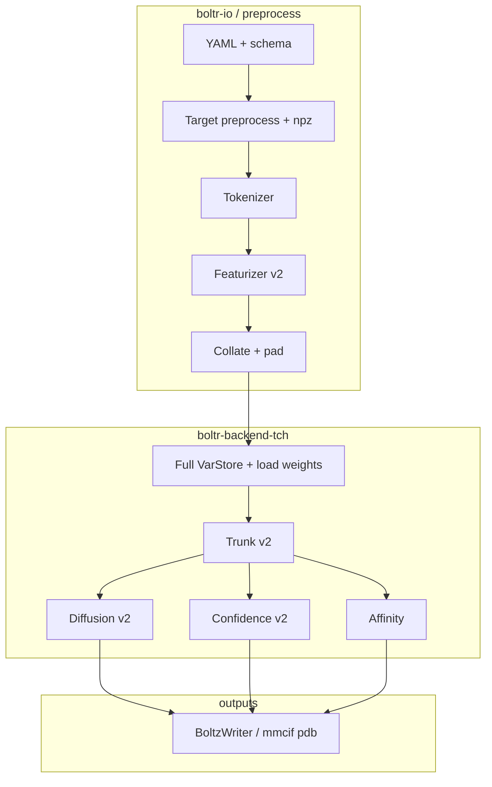

# Boltr: Boltz2-in-Rust developer backlog

This file is the **master implementation checklist** for parity with upstream Boltz2 (`boltz-reference/`), using **`tch-rs` + LibTorch** (CPU or CUDA). It is meant to be split across engineers without losing track of dependencies.

**Do not treat items as done until** there is either a **golden test** (tensor or file diff vs Python on a fixed fixture) or an **explicit sign-off** that the slice is out of scope for v1.

---

## How to use this document

1. Pick a **workstream** (sections 3–7). Read the **Python reference paths** first.
2. Note **Depends on** before starting; unblock upstream tasks first.
3. For each task, complete **Deliverables** and **Acceptance**.
4. Update the checkbox in your PR (`[ ]` → `[x]`) for the rows you finish.
5. Keep **numerical parity** against Python with `use_kernels=False` (no cuequivariance fused kernels in Rust). GPU = CUDA LibTorch, not Python’s `boltz[cuda]` wheels.

**Related docs:** [DEVELOPMENT.md](DEVELOPMENT.md), [docs/TENSOR_CONTRACT.md](docs/TENSOR_CONTRACT.md), [docs/PYTHON_REMOVAL.md](docs/PYTHON_REMOVAL.md), [boltz-reference/docs/prediction.md](boltz-reference/docs/prediction.md).

---

## 1. Parity rules (non-negotiable)

| Topic | Rule |
|--------|------|
| Reference CLI | `boltz-reference/src/boltz/main.py` defines URLs, preprocess steps, datamodules, writers. |
| Checkpoint | Lightning `.ckpt` → export with [scripts/export_checkpoint_to_safetensors.py](scripts/export_checkpoint_to_safetensors.py); Rust loads `.safetensors` into `tch` (key names must match after any `strip-prefix`). |
| Triangle / pair ops | Match **PyTorch fallback** when `use_kernels=False` (`boltz-reference/.../triangular_mult.py`, `triangular_attention/` without cuequivariance). |
| Mixed precision | Boltz2 inference uses bf16 in places; mirror Python’s **`autocast("cuda", enabled=False)` islands** with explicit F32 where Python disables autocast. |
| Tests | Prefer **golden tensors** exported from Python for the smallest input that exercises the code path. |

---

## 2. High-level dependency order

Work generally flows **top-to-bottom**. Multiple people can parallelize **within** a stage only when dependencies are clear (e.g. layers inside pairformer after tensor shapes are frozen).

---

## 3. Tooling, build, and CI

| Status | Task | Details |
|--------|------|---------|
| [x] | LibTorch build matrix | Document CPU vs CUDA; `LIBTORCH` / `LIBTORCH_USE_PYTORCH` ([DEVELOPMENT.md](DEVELOPMENT.md)). |
| [x] | CLI device flags | `--device`, `BOLTR_DEVICE`; CUDA availability check in backend. |
| [ ] | Default feature policy | Decide: keep `default = []` for LibTorch-free CI vs developer profile alias; document in README. |
| [ ] | Optional CUDA CI job | Nightly or manual workflow with CUDA LibTorch smoke test (single matmul or `s_init` forward). |
| [ ] | Checkpoint export automation | Makefile / `xtask` to run export script + verify key count vs Lightning `state_dict`. |
| [ ] | Hyperparameter manifest | Export `hparams.yaml` or JSON from ckpt for Rust `Boltz2Model::from_config` (avoid hardcoding dims). |

**Acceptance:** A new machine can go from clone → `cargo test` (no GPU) and optionally → GPU build with documented env vars.

---

## 4. `boltr-io`: input, preprocess, features (largest effort)

### 4.1 YAML and chemistry (Boltz schema)

| Status | Task | Python reference | Deliverables |
|--------|------|------------------|--------------|
| [x] | Minimal YAML types | `parse/yaml.py`, `parse/schema.py` | Expand [boltr-io/src/config.rs](boltr-io/src/config.rs) for full schema: constraints, templates, properties.affinity, modifications, cyclic. |
| [ ] | Full schema parse | `schema.py` | Port `parse_boltz_schema` pipeline: entities, bonds, ligands (SMILES/CCD), polymer types. **Depends on:** CCD/molecule loading. |
| [ ] | CCD / molecules | `mol.py`, `main.py` (ccd.pkl, mols.tar) | Load or interface with `ccd.pkl`; ligand graphs for featurizer. Consider thin FFI or subprocess only if unavoidable—document tradeoff. |
| [ ] | Structure parsers | `parse/mmcif.py`, `parse/pdb.py`, `mmcif_with_constraints.py` | Parse inputs for templates and processed structures. |
| [ ] | Constraints serialization | preprocess in `main.py` | Match npz layouts consumed by `load_input` in inferencev2. |

**Acceptance:** Given the same YAML + assets as Python, Rust produces the **same** internal `Record` / target representation (or byte-identical intermediate files).

### 4.2 MSA

| Status | Task | Python reference | Deliverables |
|--------|------|------------------|--------------|
| [x] | ColabFold server client | `msa/mmseqs2.py` | [boltr-io/src/msa.rs](boltr-io/src/msa.rs) (review pairing / auth if Boltz exposes). |
| [ ] | MSA file formats | `parse/a3m.py`, `parse/csv.py` | Read/write `.a3m` and paired `.csv` as Python. |
| [ ] | MSA → npz | `main.py` preprocess, `types.py` (`MSA`) | Emit same `.npz` as Python for `MSA.load`. |

**Acceptance:** Same `.npz` hash or tensor allclose after load for a fixed input.

### 4.3 Tokenizer (Boltz2)

| Status | Task | Python reference | Deliverables |
|--------|------|------------------|--------------|
| [ ] | `Boltz2Tokenizer` | `tokenize/boltz2.py`, `tokenize/tokenizer.py` | Rust module e.g. `boltr-io/src/tokenize/boltz2.rs` (or new `boltr-preprocess` crate if binary size matters). |
| [ ] | Token/atom bookkeeping | `types.py` (`Tokenized`, etc.) | Mirror fields used by featurizer. |

**Acceptance:** `tokenize` output matches Python **field-by-field** on a golden complex (dump + diff in tests).

### 4.4 Featurizer (Boltz2)

| Status | Task | Python reference | Deliverables |
|--------|------|------------------|--------------|
| [ ] | Constants / enums | `data/const.py` | Port ids, atom names, bond types, mol types used in features. |
| [ ] | `process_token_features` | `feature/featurizerv2.py` | Token-level tensors. |
| [ ] | `process_atom_features` | same | Atom-level tensors, distograms, windows. |
| [ ] | `process_msa_features` | same | MSA embedding path; affinity variant (`affinity=True`). |
| [ ] | `process_template_features` | same + dummy templates | Real + dummy template tensors. |
| [ ] | Ensemble / symmetry / constraints | same + `feature/symmetry.py` | Optional flags parity with inference. |
| [ ] | Padding utilities | `pad.py` | Match `pad_to_max` behavior in collate. |

**Acceptance:** For one **frozen** Python export (`dict[str, Tensor]` after `collate`), Rust produces **allclose** tensors (document rtol/atol per key in test).

### 4.5 Inference dataset / collate

| Status | Task | Python reference | Deliverables |
|--------|------|------------------|--------------|
| [ ] | `load_input` | `module/inferencev2.py` | Build `Input` from dirs + npz paths. |
| [ ] | `collate` | same | Stack/pad rules for each key (see exclusions in Python). |
| [ ] | Affinity crop | `crop/affinity.py` | If parity with affinity inference is required. |

**Acceptance:** Batch dict from Rust equals Python on golden fixture.

### 4.6 Output writers

| Status | Task | Python reference | Deliverables |
|--------|------|------------------|--------------|
| [ ] | `BoltzWriter` | `write/writer.py` | Predictions folder layout, confidence outputs. |
| [ ] | `BoltzAffinityWriter` | same | Affinity-specific outputs. |
| [ ] | Structure formats | `write/mmcif.py`, `write/pdb.py`, `write/utils.py` | Same files consumers expect. |

**Acceptance:** `boltz predict` vs `boltr predict` on same input → comparable structures / scores within tolerance.

---

## 5. `boltr-backend-tch`: Boltz2 model graph

Implement in **topological** order: lower modules first, then composite. Suggested Rust layout under [boltr-backend-tch/src/boltz2/](boltr-backend-tch/src/boltz2/) (extend as needed).

### 5.1 Infrastructure

| Status | Task | Python reference | Deliverables |
|--------|------|------------------|--------------|
| [x] | Device + CUDA check | N/A | [device.rs](boltr-backend-tch/src/device.rs) |
| [x] | Safetensors load | N/A | [checkpoint.rs](boltr-backend-tch/src/checkpoint.rs); extend dtypes as needed. |
| [ ] | Full `VarStore` mapping | `boltz2.py` `__init__` | Every submodule’s parameters load from exported keys; test `load_strict` equivalent. |
| [ ] | Config struct | `Boltz2` hyperparameters | Single Rust type built from manifest JSON/YAML. |

### 5.2 Embeddings and trunk input

| Status | Task | Python reference | Rust target (suggested) |
|--------|------|------------------|-------------------------|
| [ ] | `InputEmbedder` | `modules/trunkv2.py` + embedder args | `boltz2/embedder.rs` |
| [ ] | `RelativePositionEncoder` | `modules/encodersv2.py` | `boltz2/relative_position.rs` |
| [ ] | `s_init`, `z_init_*`, bonds, contact conditioning | `trunkv2.py` | Extend [model.rs](boltr-backend-tch/src/boltz2/model.rs) |
| [ ] | LayerNorm / recycling projections | `trunkv2.py` | Same module |

### 5.3 Templates

| Status | Task | Python reference | Deliverables |
|--------|------|------------------|--------------|
| [ ] | `TemplateV2Module` / `TemplateModule` | `trunkv2.py`, template args | `boltz2/template.rs`; gated by YAML templates. |

### 5.4 MSA module

| Status | Task | Python reference | Deliverables |
|--------|------|------------------|--------------|
| [ ] | `MSAModule` | `trunkv2.py`, `msa_args` | `boltz2/msa_module.rs` |

### 5.5 Pairformer stack

| Status | Task | Python reference | Deliverables |
|--------|------|------------------|--------------|
| [ ] | `PairformerModule` | `layers/pairformer.py` | `boltz2/pairformer.rs` |
| [ ] | Attention variants | `attention.py`, `attentionv2.py` | Submodules |
| [ ] | Triangular multiplication (fallback) | `triangular_mult.py` | **No cuequivariance**; pure torch ops path only. |
| [ ] | Triangular attention (fallback) | `triangular_attention/*` | Same |
| [ ] | Transition / outer product mean | `transition.py`, `outer_product_mean.py` | |
| [ ] | Dropout, mask handling | `dropout.py`, pair masks | |

**Acceptance:** Single pairformer block output matches Python golden tensor for fixed `(s, z, mask)`.

### 5.6 Diffusion conditioning + structure

| Status | Task | Python reference | Deliverables |
|--------|------|------------------|--------------|
| [ ] | `DiffusionConditioning` | `modules/diffusion_conditioning.py` | `boltz2/diffusion_conditioning.rs` |
| [ ] | `AtomDiffusion` (v2) | `modules/diffusionv2.py` | Replace placeholder [diffusion.rs](boltr-backend-tch/src/boltz2/diffusion.rs) |
| [ ] | Score model / transformers v2 | `modules/transformersv2.py` | |
| [ ] | Distogram head | `DistogramModule` in `trunkv2.py` | |
| [ ] | Optional B-factor | `BFactorModule`, `loss/bfactor.py` | If parity required for flag. |

**Acceptance:** One reverse-diffusion step (or full sampling) matches Python within tolerance on a tiny synthetic batch.

### 5.7 Confidence

| Status | Task | Python reference | Deliverables |
|--------|------|------------------|--------------|
| [ ] | `ConfidenceModule` v2 | `modules/confidencev2.py` | Replace placeholder [confidence.rs](boltr-backend-tch/src/boltz2/confidence.rs) |
| [ ] | Supporting layers | `confidence_utils.py`, etc. | |

### 5.8 Affinity

| Status | Task | Python reference | Deliverables |
|--------|------|------------------|--------------|
| [ ] | `AffinityModule` (+ ensemble if used) | `modules/affinity.py` | Replace placeholder [affinity.rs](boltr-backend-tch/src/boltz2/affinity.rs) |
| [ ] | MW correction | `boltz2.py` flags | Match `affinity_mw_correction` behavior. |

### 5.9 Potentials / steering (optional parity)

| Status | Task | Python reference | Note |
|--------|------|------------------|------|
| [ ] | Inference potentials | `model/potentials/*`, `predict` args | Only if CLI parity requires `--use_potentials` behavior. |

### 5.10 Top-level `Boltz2` forward

| Status | Task | Python reference | Deliverables |
|--------|------|------------------|--------------|
| [ ] | `predict_step` / inference path | `boltz2.py` | Single entry that runs recycling, trunk, diffusion sampling, confidence, optional affinity. |
| [ ] | Recycling loop | `boltz2.py` | Match step counts from `predict_args`. |

**Acceptance:** End-to-end: collated batch → coordinates + confidence tensors → writer output matches Python on a **small** regression complex.

---

## 6. `boltr-cli`: user-facing commands

| Status | Task | Details |
|--------|------|---------|
| [x] | `download` | Checkpoints + ccd + mols URLs aligned with `main.py`. |
| [~] | `predict` | Parses YAML, optional MSA, summary JSON; **wire full pipeline** when 4.x + 5.x complete. |
| [ ] | Flags parity | Mirror important Boltz flags: recycling, sampling steps, diffusion samples, potentials, affinity-only pass, output format. |
| [ ] | `eval` | Port or wrap evaluation ([boltz-reference/docs/evaluation.md](boltz-reference/docs/evaluation.md)) if required. |

---

## 7. Testing strategy (cross-cutting)

| Status | Task | Details |
|--------|------|---------|
| [ ] | Golden fixture repo layout | `tests/fixtures/` with YAML, optional tiny npz, README describing how regenerated from Python. |
| [ ] | Python export scripts | Small scripts next to `export_checkpoint_to_safetensors.py` to dump featurizer batch + intermediate activations. |
| [ ] | Numerical tolerances | Document per-tensor rtol/atol; strict for embeddings, looser for sampling. |
| [ ] | Regression test harness | Optional: subprocess `boltz predict` vs `boltr predict` diff. |

---

## 8. Python removal (gated)

Do **not** delete `boltz-reference/` chunks until Rust replaces them with tests. See [docs/PYTHON_REMOVAL.md](docs/PYTHON_REMOVAL.md).

| Milestone | Action |
|-----------|--------|
| Featurizer golden tests pass | May trim redundant docs only. |
| Full predict parity on fixture set | Submodule upstream Boltz or drop vendor + pin fixtures. |
| Long-term | Keep minimal Python for export/regression only. |

---

## 9. Suggested parallel workstreams (people)

These can proceed **in parallel** once interfaces are agreed (tensor names/shapes in `docs/TENSOR_CONTRACT.md`):

1. **Featurizer team:** §4.3–4.5 (blocked only on §4.1–4.2 for parser outputs).
2. **Pairformer team:** §5.5 (blocked on §4.4 golden batch + §5.1 VarStore).
3. **Diffusion team:** §5.6 (blocked on trunk output tensors).
4. **Writers team:** §4.6 (can start from Python dumps of expected files).
5. **Affinity team:** §5.8 (blocked on affinity featurizer path).

---

## 10. Quick reference: Python file → Boltz2 relevance

**Must-have for inference parity**

- `main.py` — CLI contract, preprocess, URLs.
- `data/module/inferencev2.py` — dataset + collate.
- `data/feature/featurizerv2.py` — features.
- `data/tokenize/boltz2.py` — tokens.
- `data/types.py`, `data/const.py`, `data/pad.py`, `data/mol.py`.
- `model/models/boltz2.py` — forward graph.
- `model/modules/trunkv2.py`, `diffusionv2.py`, `diffusion_conditioning.py`, `confidencev2.py`, `affinity.py`, `encodersv2.py`, `transformersv2.py`.
- `model/layers/pairformer.py`, `attention*.py`, `triangular_*`, `transition.py`, `outer_product_mean.py`.
- `data/write/writer.py` — outputs.

**Training-only / lower priority for Rust v1**

- `data/module/training*.py`, `data/sample/*`, `data/filter/*`, most of `model/loss/*`, `model/optim/*` (unless needed for EMA parity in inference).

---

*Last generated for repo layout as of Boltr workspace with `boltz-reference` vendor tree. Update this file when major milestones land.*
